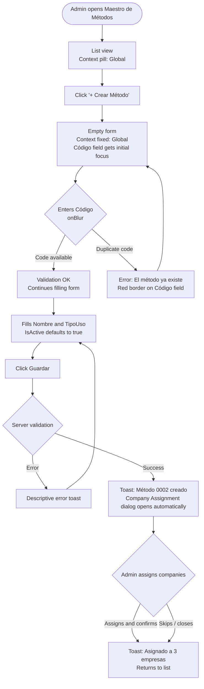
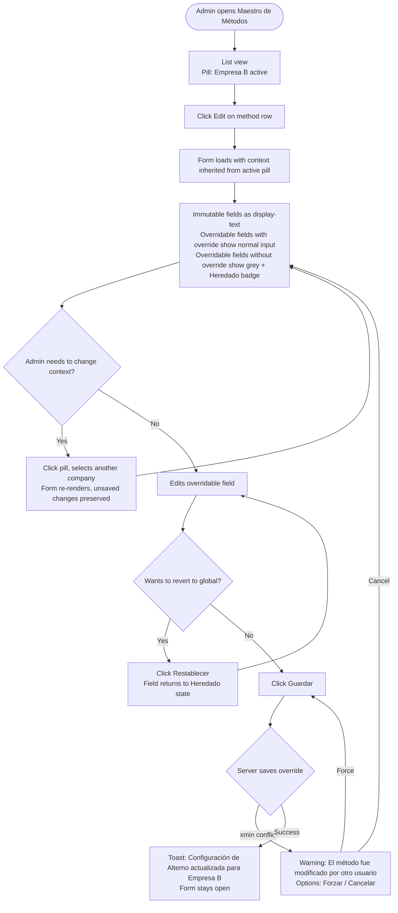
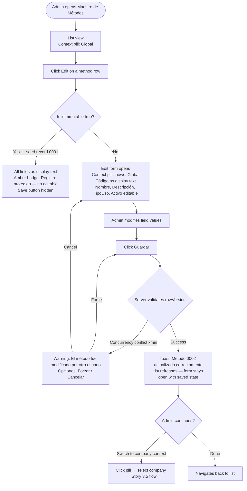
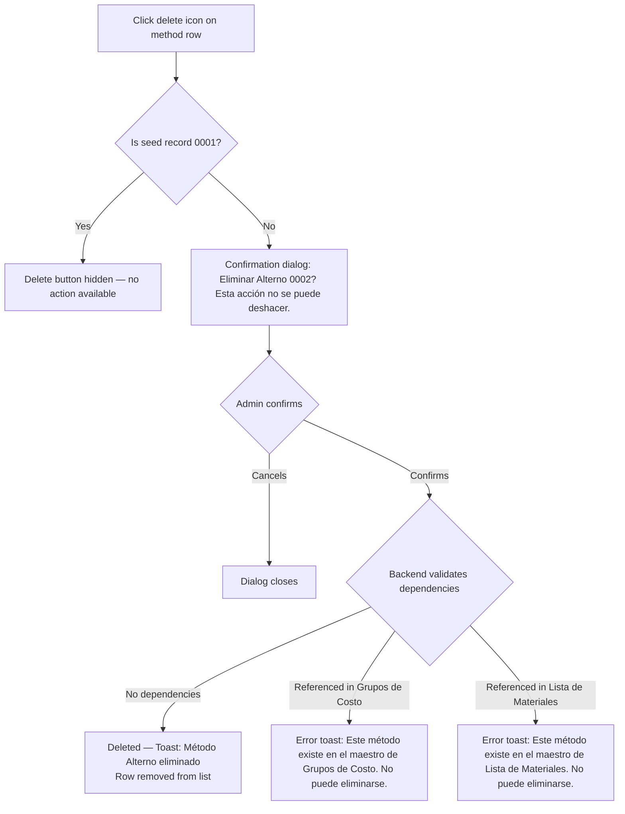

# UX Design Specification - Siesa-Agents (MfgStructure)

**Author:** SiesaTeam
**Date:** 2026-03-06

---

## Executive Summary

### Project Vision

The Methods Master (Maestro de Métodos) is a foundational administration module within the Siesa ERP Manufacturing microfrontend. It provides global administrators and company administrators with a unified interface to manage manufacturing method definitions — the catalog entity that classifies how products are produced and costed. The module implements the **GLOBAL + Override** pattern: methods are defined once globally and each company can independently override configurable fields without affecting others.

This is a blocking prerequisite for Routes of Operation, Bills of Materials, and Cost Groups — its correct delivery directly unblocks the rest of the Manufacturing module.

### Target Users

| Profile | Role in this module | Key permission |
|---------|---------------------|----------------|
| **Global Administrator** | Creates and manages methods globally; assigns methods to companies; edits immutable fields | `update_global`, `create`, `assign` |
| **Company Administrator** | Overrides method configuration scoped to their company | `update` |
| **Standard Administrator** | Reads, queries, and deletes methods without dependencies | `read`, `delete` |
| **ERP Planner / Operator** | Consumes methods indirectly via LookupField in dependent masters (Routes, BOM, Cost Groups) | `read` (indirect) |

Users are experienced ERP technicians who work on desktop. The interface must be efficient and precise — not consumer-oriented. They value data clarity, fast operations, and unambiguous feedback over visual novelty.

### Key Design Challenges

1. **Dual-context editing model** — The same form behaves differently depending on whether the user is editing in Global context (immutable fields become editable with elevated permissions) or Company context (only overridable fields are editable; immutable fields are always read-only). The user must always understand which context they are operating in.

2. **Override inheritance visibility** — A `NULL` company override means "inherit from global base." The UI must communicate clearly which field values are inherited vs. explicitly overridden, so administrators can confidently manage per-company configurations.

3. **RBAC-adaptive interface** — The form must reflect the authenticated user's permissions dynamically. A company administrator must never see global-only fields as editable, regardless of the context selector state.

### Design Opportunities

1. **siesa-ui-kit `MasterCrud` component** — The existing component catalog likely covers the list view + form pattern directly. Leveraging it reduces implementation risk and ensures consistency with other ERP modules.
2. **Global/Company context pattern as reusable standard** — Designing this well establishes a visual and interaction pattern reusable across future masters (Work Centers, etc.) in the same module.
3. **LookupField already solved** — The siesa-ui-kit `LookupField` component handles dependent master consumption natively; no custom search UI is needed.

---

## Core User Experience

### Defining Experience

The central user action is **"open a method → switch to company context → edit override → save"**. While method creation happens infrequently (the catalog is small), company-scoped configuration adjustments occur regularly as companies activate/deactivate methods or add company-specific descriptions.

The second most frequent interaction is **method lookup consumption** — planners and configurators of dependent masters (Routes, BOM, Cost Groups) trigger LookupField searches dozens of times per day. This interaction is invisible to the Methods module itself but directly depends on its data quality.

### Platform Strategy

- **Platform:** Web desktop microfrontend (Single-SPA architecture)
- **Input model:** Mouse + keyboard; no touch requirement
- **Offline:** Not required — always-connected ERP back-office environment
- **Resolution:** Standard desktop (1280px+ width)
- **Device-specific features:** None — standard browser capabilities only

### Effortless Interactions

1. **Global ↔ Company context switching** — Changing the active context must be instantaneous with immediate visual adaptation of field editability states. No page reload; no data loss of unsaved changes.
2. **Real-time code uniqueness validation** — Feedback on code uniqueness appears on `onBlur`, never requiring a full form submit cycle to discover a conflict.
3. **Automatic company assignment dialog** — After creating a method, the assignment dialog opens automatically. The user should never need to navigate back to find it.
4. **Inherited value display** — Fields with no company override should display the inherited global value as placeholder text (dimmed / secondary style), making the inheritance state obvious without extra clicks.

### Critical Success Moments

| Moment | Why it's critical |
|--------|-------------------|
| Admin sees at a glance which fields are inherited vs. overridden | Without this, the GLOBAL/Company override model creates constant confusion |
| Delete error message names the specific dependent master | A generic "cannot delete" message forces the user to investigate; a named dependency ("exists in Cost Groups") makes the next action obvious |
| Seed record `0001` protection is visible before attempting to edit | Reactive error-only feedback is a UX failure; the record should signal its immutability proactively |
| Context switch preserves unsaved changes | Losing work when switching Global ↔ Company context would be a trust-breaking experience |

### Experience Principles

1. **Context is always visible** — The active scope (Global vs. Company X) must be unambiguously displayed at all times during form interactions. Users should never have to ask "which context am I in?"
2. **Inheritance is explicit, not hidden** — Inherited field values are visually distinct from explicitly set values. The system shows what is inherited and from where.
3. **Errors are actionable, not just informative** — Every error message tells the user what went wrong AND what they can do next. No dead-end error states.
4. **Efficiency over expressiveness** — This is an ERP back-office tool. Density, scannability, and keyboard efficiency take priority over visual richness or animation.

---

## Desired Emotional Response

### Primary Emotional Goals

**Primary: Confidence and Control**

The administrator feels complete visibility over the configuration state. They know exactly what they are doing, understand the scope and impact of their changes, and trust that the system will clearly signal problems before they cause consequences. This is not consumer delight — it is professional confidence: the feeling that an expert tool is working *with* them.

**Supporting: Efficient Satisfaction**

After completing a task (creating a method, saving a company override, assigning companies), the user feels a clean sense of "done." The system confirms success clearly and the path back to work is immediate. No lingering doubt about whether the action took effect.

### Emotional Journey Mapping

| Stage | Desired Emotion | Emotion to Avoid |
|-------|----------------|-----------------|
| Opening the methods list | Clarity — "I can see everything I need" | Overwhelmed — "too much going on" |
| Creating a new method | Confidence — "I am filling this in correctly" | Uncertainty — "am I doing this right?" |
| Switching to company context | Control — "I know exactly what I can edit here" | Confusion — "what applies to whom?" |
| Saving a company override | Satisfaction — "done, it's configured" | Doubt — "did it save? did it affect others?" |
| Receiving a delete error | Clarity — "I understand why and know what to do next" | Frustration — "generic error, no idea what happened" |
| Returning after days away | Familiarity — "I remember how this works" | Relearning — "where was that option again?" |

### Micro-Emotions

The three micro-emotional states most critical to this module's success:

- **Confidence vs. Uncertainty** — Does the user always know the impact of their changes? Achieved through: explicit context labels, inherited value display, confirmation messages that describe what was saved.
- **Control vs. Anxiety** — Can users explore the form without fear of accidentally breaking something? Achieved through: clear read-only states for immutable fields, unsaved-changes preservation on context switch, descriptive error messages.
- **Satisfaction vs. Indifference** — Does task completion feel like a clear achievement? Achieved through: visible success feedback, automatic next-step suggestions (e.g., company assignment dialog after creation).

### Design Implications

| Target emotion | UX design approach |
|---------------|-------------------|
| Confidence | Active context indicator always visible; field-level labels showing "Global value" vs. "Company override" |
| Control | Read-only fields visually distinct (not just disabled); unsaved changes preserved on context switch |
| Satisfaction | Explicit success toasts with action summary ("Method 0002 created and assigned to 3 companies") |
| Clarity on errors | Error messages name the specific cause and suggest next action; no generic "operation failed" messages |
| Familiarity on return | Consistent layout and interaction patterns aligned with siesa-ui-kit MasterCrud conventions used elsewhere in ERP |

### Emotional Design Principles

1. **Never leave the user wondering** — Every action produces visible feedback. Success is confirmed; errors are explained; inherited values are shown.
2. **Calm through structure** — The interface uses consistent visual hierarchy and predictable layouts to reduce cognitive load. Users should never feel lost.
3. **Respect expertise** — These are ERP professionals. The design respects their knowledge: no over-explaining, no patronizing confirmations for low-risk actions, but always explicit confirmation for destructive or multi-company-impacting operations.

---

## UX Pattern Analysis & Inspiration

### Inspiring Products Analysis

The primary UX reference for this module is the **siesa-ui-kit component library itself** — specifically the `MasterCrud`, `ListView`, and `TableLayoutView` components that already encode Siesa's established ERP interaction patterns. Secondary references are drawn from mature ERP systems (SAP S/4HANA, Microsoft Dynamics 365) that the administrator user base already understands.

**siesa-ui-kit / Siesa ERP current platform:**
- Established list + form master pattern already familiar to target users
- `MasterCrud` component covers the CRUD lifecycle with consistent behavior
- `LookupField` solves dependent master consumption natively
- Design token system (brand colors, typography) ensures visual consistency

**SAP S/4HANA — Master Data screens:**
- Strength: predictable global/org structure with persistent org context selector
- Strength: dense information tables that experts navigate efficiently
- Weakness to avoid: excessive modal dialogs for simple field edits; deep navigation hierarchies

**Microsoft Dynamics 365 / Business Central:**
- Strength: company/legal entity context always visible in top bar — users are never unsure which scope is active
- Strength: inline column filters in list views without requiring a separate filter panel
- Weakness to avoid: ribbon/toolbar pattern with too many buttons — prefer contextual per-row actions

### Transferable UX Patterns

**Context / Scope Patterns:**
- **Persistent scope indicator** (from Dynamics 365) — the active company context shown as a badge/label near the form title, always visible during editing. Directly addresses the dual-context challenge.
- **Scope-aware field state** (from SAP) — immutable fields rendered as display-only text (not disabled inputs) to clearly signal they are not editable in the current context, not just temporarily locked.

**List View Patterns:**
- **Inline column filters** (from Dynamics 365 / standard ERP) — filter inputs directly in column headers, no separate filter panel for basic filtering. Reduces clicks for frequent filtering tasks.
- **Per-row contextual actions** — Edit, View, Assign, Delete as icon buttons on each row; Delete hidden for the `0001` seed record.

**Form Patterns:**
- **Inherited value as placeholder** — when a company override field is `NULL` (inheriting global), display the global value as dimmed placeholder text with a "Inherited" label. Avoids blank fields that suggest missing data.
- **Automatic post-creation flow** — after saving a new entity, automatically open the next logical step (company assignment dialog) without requiring navigation. Borrowed from modern SaaS onboarding patterns.

**Feedback Patterns:**
- **Named success toasts** — "Method 0002 'Alternate' created successfully" rather than generic "Saved." Gives confidence the right record was affected.
- **Dependency-specific delete errors** — error text names the dependent master, e.g., "This method is referenced in Cost Groups and cannot be deleted." Actionable, not generic.

### Anti-Patterns to Avoid

- **Generic error messages** — "Operation failed" or "An error occurred" without specifics. Every error in this module has a known cause; all must be named.
- **Silent context switching** — changing the Global/Company context selector without visual confirmation of what changed. Users must always see the scope transition.
- **Disabled inputs for immutable fields** — disabled HTML inputs look like temporary lock, not permanent read-only. Use display text + label instead.
- **Full page reload on context switch** — switching between Global and Company context must be client-side state change, preserving unsaved edits.
- **Undifferentiated delete confirmation** — a single generic "Are you sure?" dialog for all deletes. The confirmation should name the record and, for methods with no dependency, describe what will be permanently removed.
- **Pagination-free lists** — unbounded result sets in list views. Always paginated with configurable page size.

### Design Inspiration Strategy

**Adopt directly:**
- siesa-ui-kit `MasterCrud` / `ListView` / `TableLayoutView` component structure and visual conventions
- Inline column filters for Code, Name, UseCode, IsActive
- Per-row action icons (Edit, View, Assign, Delete)

**Adapt for this module:**
- Dynamics 365 persistent scope indicator → adapt as a context selector component (Global / Company dropdown) anchored to the form header, with visual state change when switching
- SAP display-only field rendering → adapt as a read-only field variant in siesa-ui-kit style that shows label + value without input chrome

**Avoid:**
- Deep nested navigation for editing (keep it in-page or single modal)
- Ribbon/toolbar action bars (use inline row actions + form submit buttons only)
- Separate filter panel / filter sidebar (inline column headers suffice for this entity's filter set)

---

## Design System Foundation

### Design System Choice

**Primary:** siesa-ui-kit (Siesa corporate component library)
**Secondary:** shadcn/ui via MCP registry (for components not covered by siesa-ui-kit)
**Styling:** TailwindCSS 4+ with company design tokens
**Fallback:** Custom components built to siesa-ui-kit standards (requires MR approval)

This is a mandatory company standard, not a preference decision. All new Siesa ERP microfrontends must use siesa-ui-kit first.

### Rationale for Selection

- **Consistency with ERP ecosystem** — Users already know siesa-ui-kit patterns from other Siesa modules. Using the same component library reduces relearning.
- **Pre-built ERP patterns** — `MasterCrud`, `ListView`, `TableLayoutView`, and `LookupField` directly cover the core UI patterns needed for the Methods module, eliminating custom implementation risk.
- **Company brand tokens enforced** — Primary color (`#0e79fd`), typography (Inter 18pt), and dark mode are already configured in the design token system.
- **Speed** — Reusing proven components for 80%+ of the UI allows the frontend sprint to focus on the module-specific logic (dual-context form, override inheritance display) rather than base component building.

### Component Strategy for Methods Module

| UI Element | Component Source | Component Name | Notes |
|-----------|-----------------|----------------|-------|
| List + CRUD form (base shell) | siesa-ui-kit | `MasterCrud` | Covers ~75% — table, toolbar, form, pagination |
| Status badge (Activo/Inactivo) | siesa-ui-kit | `MasterCrud` via `headerBadges` | `headerBadges: (record) => Badge[]` |
| Company context pill selector | siesa-ui-kit | `MasterCrud` (built-in) | `activeByCompany: true`, `companies: CompanyDTO[]` |
| Company assignment dialog | siesa-ui-kit | `MasterCrud` (`onConfirmLinking`) | `isCompanyLinked`, `onConfirmLinking`, `canOverrideMultiCompany` |
| Delete confirmation dialog | siesa-ui-kit | `MasterCrud` (built-in) | Native — no shadcn needed |
| Field filters (UseCode, Estado) | siesa-ui-kit | `MasterCrud` fields config | `type: 'select'`, `config.searchable: true` |
| LookupField for dependent masters | siesa-ui-kit | `MasterCrud` fields config | `type: 'lookup'`, `onSearchMatches` |
| Advanced search + filter groups | siesa-ui-kit | `MasterCrud` | `showAdvancedSearch: true`, `showAdvancedSearchConnectors: true`; soporta AND/OR y grupos anidados con drag & drop |
| Batch operations | siesa-ui-kit | `MasterCrud` | `enableMultiSelect: true`, `batchActions: Action[]` |
| Toolbar global actions | siesa-ui-kit | `MasterCrud` | `globalActions: Action[]` |
| Row-level actions | siesa-ui-kit | `MasterCrud` | `actions: Action[]`, `displayType: 'direct' \| 'menu'` |
| Success / error notifications | siesa-ui-kit | `MasterCrud` | `internalErrorHandling: true` → toast automático |
| Read-only inherited value display | Custom (minimal) | `InheritedField` | Only custom component needed — dimmed value + "Heredado" badge; candidate for siesa-ui-kit contribution |

**shadcn/ui dependency: NONE** — all UI elements are covered by siesa-ui-kit natively.

### Customization Strategy

- **Design tokens:** Use company-defined Tailwind config (`primary-600: #0e79fd`, `tertiary-800: #154ca9`, Inter font weights). No custom hex codes outside the token system.
- **Dark mode:** Implemented via Tailwind `class` strategy on `html` element. All components use `dark:` variants per `technical-preferences-ux.md`.
- **Custom components (minimal):** Only the "inherited value" field display requires a custom mini-component — a read-only field variant showing the inherited global value as dimmed text with an "Inherited" label badge. This should be proposed as a contribution to siesa-ui-kit for reuse in Work Centers and other future masters.
- **Spanish UI text mandatory:** All labels, button text, error messages, and tooltips in Spanish per company standard.

---

## Design Direction Decision

### Design Directions Explored

Four directions were explored, all sharing the same visual foundation (siesa-ui-kit tokens, TailwindCSS) but differing in how the Global/Company context selector is presented:

| # | Name | Context selector approach |
|---|------|--------------------------|
| 1 | Selector in Header | Pill button below title, opens company dropdown |
| 2 | Side Panel | Fixed sidebar listing assigned companies |
| 3 | Context Tabs | One tab per company with override count badge |
| 4 | Split View | Global column + Company column side by side |

Reference file: `_bmad-output/planning-artifacts/ux-design-directions.html`

### Chosen Direction

**Direction 1 — Context Pill Button** (confirmed by SiesaTeam)

The context selector follows the **siesa-ui-kit MasterCrud native pattern**: a compact pill button positioned below the entity title in both the list view and the edit form. The pill shows the active context (Global or company name) and opens a dropdown listing all assigned companies with name + code.

**Exact pattern (from siesa-ui-kit):**
- Pill styled with `background:#f3f0ff`, `color:#6d28d9`, `border:#ddd6fe`, `border-radius:9999px`
- Globe icon for Global context; building icon for company contexts
- Dropdown entries show: company name (bold) + `CÓDIGO: 000` (secondary text)
- Active entry highlighted with `background:#f5f3ff`
- Pill appears in **two locations**: below the list title AND below the form title

### Design Rationale

- **Consistency with siesa-ui-kit** — matches the exact pattern already used in other MasterCrud screens (e.g., Gestión de Colaboradores), so users recognize it immediately
- **Minimal footprint** — a compact pill takes almost no vertical space, keeping the list and form layouts clean
- **Context always visible** — the pill is always present and shows the active scope at a glance without requiring a separate dedicated bar
- **Same UX in list and form** — using the identical pill in both screens creates a consistent mental model: the user changes context the same way regardless of whether they are browsing or editing

### Implementation Approach

- List view: pill positioned below `<h2>` title, above the `MasterCrudToolbar`
- Edit form: pill positioned below `<h3>` form title, above the field grid
- On context change: re-fetch list data or re-render form fields with the selected company's effective values
- Pill state is shared between list and form (selecting a company in the list pre-selects it when opening the form)

---

## User Journey Flows

### Journey 1 — Global Administrator Creates a New Method



### Journey 2 — Company Administrator Overrides Method Configuration



### Journey 3 — Global Administrator Edits an Existing Method



### Journey 4 — Delete Method



### Journey Patterns

| Pattern | Applies to | Implementation |
|---------|-----------|----------------|
| **Context pill persistence** | List + Form | Active company pill state shared; selecting in list pre-selects in form |
| **Automatic next-step dialog** | Post-creation | Company assignment dialog opens automatically after save |
| **Inherited field visual state** | Edit form | Grey input + "Heredado" badge for NULL overrides; normal input for active overrides |
| **Revert to inherited** | Edit form | "Restablecer" button sets override field back to NULL |
| **Named dependency errors** | Delete | Error message always names the specific dependent master |
| **Proactive seed protection** | List + Form | Delete button hidden for `0001`; fields shown as display-text with system label |

### Flow Optimization Principles

1. **Context follows the user** — pill state persists from list to form; user never reselects their company when navigating.
2. **Zero dead-end errors** — every error state offers a clear next action (fix field, force save, navigate to dependency, or cancel).
3. **Post-creation flow is automatic** — company assignment dialog opens without extra navigation.
4. **Destructive actions require explicit confirmation** — delete always shows a confirmation dialog naming the record; seed `0001` never presents the option.

---

## Detailed Interaction Specifications

### Defining Interaction

> **"Ver el estado real de un método para mi empresa y ajustarlo sin afectar a las demás"**

The defining interaction is **dual-context editing**: the administrator opens a method, selects their company scope, sees which fields are inherited from the global definition vs. explicitly overridden, and edits only what they need — with full confidence that their changes are scoped to their company only.

This is not a novel interaction pattern — it follows established ERP scope-selector conventions (SAP org selector, Dynamics company context) that the target users already understand. The innovation is in making the **inheritance state explicitly visible** rather than implicit (blank field = inherited), which is the most common source of confusion in ERP override systems.

### User Mental Model

Administrators arrive with this mental model from existing ERP experience:

- **Global fields** = "system definition, I can't change these" (read-only to me)
- **Override fields** = "my company's local configuration"
- **Empty override field** = "use the system default"
- **Saving here** = "only affects my company, not others"

**Critical gap to address:** In most ERPs, an empty override field is visually identical to a field with no data. Users cannot tell if the value showing is "inherited from global" or "this company has no data." This module must make that distinction explicit.

### Interaction Success Criteria

| Criterion | Implementation signal |
|---|---|
| User always knows active context | Context selector visible and labeled at top of form at all times |
| User distinguishes inherited vs. overridden fields | Inherited fields: dimmed value + "Heredado" badge; overridden fields: normal input style |
| Context switch preserves unsaved edits | State preserved in component on scope change; no data loss |
| Delete error names exact dependency | Error message: "Este método existe en el maestro de Grupos de Costo. No puede eliminarse." |
| Seed record `0001` protection is proactive | Delete action hidden for `0001`; fields show "Registro del sistema — no modificable" label |

### Component Architecture (MasterCrud-based)

```
MasterCrud (base — covers ~75% of the screen)
├── MasterCrudTable        → paginated list, inline column filters
├── MasterCrudToolbar      → search, view toggle
├── MasterCrudForm         → create / edit form
│   ├── disabledOnEdit     → Código field (read-only after creation)
│   ├── permissions        → canCreate, canUpdate, canDelete from RBAC
│   ├── actions[]          → "Asignar Empresas" → modalContent (nested assignment CRUD)
│   └── type: 'lookup'     → LookupField for dependent master consumption
│
└── [Custom wrapper — GLOBAL+Override layer]
    ├── ScopeSelector      → Select component: "Global" | "Empresa X"
    ├── InheritedField     → renderForm custom: dimmed value + "Heredado" badge
    ├── disabled(data)     → function evaluating active scope + user permissions
    └── ResetToGlobal      → button inside renderForm to set override field back to NULL
```

**What MasterCrud handles natively:**
- List + form lifecycle, pagination, search, sort, filters
- `disabledOnEdit: true` for Código (read-only after creation)
- `permissions` prop for RBAC-driven UI control
- `actions + modalContent` for the Company Assignment dialog (nested CRUD)
- `internalErrorHandling` for toast notifications
- Field types: `text`, `select` (UseCode, IsActive), `lookup` (LookupField)

**What requires custom implementation around MasterCrud:**
- Scope selector (Global / Company dropdown above the form)
- Inherited value rendering (`renderForm` custom per overridable field)
- Context-aware `disabled(data)` function that evaluates both scope and user permissions
- "Restablecer a global" button (sets field to `null` → triggers inheritance)

### Experience Mechanics — Core Flow

**Flow: Company administrator edits a method override**

1. **Initiation** — Admin clicks "Editar" on a method row in the list. MasterCrudForm opens.
2. **Default state** — Form loads in **Global context** (scope selector shows "Global"). Immutable fields (Código, Nombre) shown as display text. Overridable fields (Descripción, TipoUso, Activo) shown as editable inputs with current global values.
3. **Scope change** — Admin selects their company from the scope selector. Form transitions: Código and Nombre remain as display text (immutable in all contexts); overridable fields that have no company override show their global value dimmed with "Heredado" badge; fields with an existing override show the override value in normal input style.
4. **Edit** — Admin modifies only the fields they need. Modified fields transition visually from "Heredado" to "Editando..." state.
5. **Reset to inherited** — Admin can click "Restablecer" on any overridden field to set it back to `null` (inherit from global). The field returns to dimmed/Heredado state.
6. **Save** — Admin clicks "Guardar". System saves only the changed override fields. Toast: _"Configuración de 'Alterno' actualizada para Empresa X."_
7. **Completion** — Form remains open showing saved state. Admin can switch to another company or navigate back to list.

---

## Visual Design Foundation

### Color System

Brand guidelines are fully defined in `technical-preferences-ux.md`. This module applies them as follows:

**Brand tokens:**

| Token | Value | Usage in this module |
|-------|-------|---------------------|
| `primary-600` | `#0e79fd` | Primary buttons (Guardar, Crear), active links, focus rings |
| `tertiary-800` | `#154ca9` | Secondary accents, active scope indicator border |
| `secondary-950` | `#000000` | Brand elements only — not used for backgrounds or neutrals |
| `slate-*` | Tailwind defaults | Page backgrounds, card surfaces, borders, secondary text |
| `green-500` | Tailwind default | Success toasts, "Activo" badge |
| `red-500` | Tailwind default | Error messages, "Inactivo" badge, validation errors |
| `amber-500` | Tailwind default | Concurrency conflict warnings, seed record indicator |

**Module-specific semantic colors:**

| UI State | Tailwind classes |
|----------|-----------------|
| Inherited field (NULL override) | `text-slate-400 bg-slate-50` + badge `bg-slate-100 text-slate-500` |
| Overridden field (has company value) | Standard input style — no additional badge |
| Active company context indicator | `bg-primary-50 text-primary-700 border-primary-200 dark:bg-primary-950 dark:text-primary-300` |
| Seed record `0001` system badge | `bg-amber-100 text-amber-800 dark:bg-amber-950 dark:text-amber-300` |
| "Activo" status badge | `bg-green-50 text-green-800 dark:bg-green-950 dark:text-green-300` |
| "Inactivo" status badge | `bg-red-50 text-red-800 dark:bg-red-950 dark:text-red-300` |

**Dark mode:** Implemented via Tailwind `class` strategy on `html`. All color tokens include `dark:` variants per company standards.

### Typography System

Font: **Inter 18pt** family (3 weights available as local assets).

| Role | Classes | Usage |
|------|---------|-------|
| Page/section title | `text-2xl font-bold` (Inter Bold) | "Maestro de Métodos" heading |
| Table column headers | `text-sm font-medium` (Inter Regular) | Código, Nombre, Tipo Uso, Estado |
| Form field labels | `text-sm font-medium` (Inter Regular) | Input labels |
| Table cell values | `text-sm font-normal` (Inter Regular) | Data rows |
| Inherited field values | `text-sm font-light text-slate-400` (Inter Light) | Dimmed inherited values |
| Badge text | `text-xs font-semibold` (Inter Bold) | Heredado, Activo, Inactivo badges |
| Error / helper text | `text-xs font-normal text-red-600` | Validation messages below fields |

### Spacing & Layout Foundation

- **Base spacing unit:** 8px (`p-2`, `gap-2` in Tailwind)
- **Layout density:** Medium-high — efficient ERP back-office, not consumer-oriented
- **Form container:** `max-w-2xl mx-auto` for edit/create forms
- **Table:** Full container width with horizontal scroll on overflow
- **Form grid:** 2-column grid (`grid grid-cols-2 gap-4`) for standard fields; `col-span-2` for Descripción (textarea)
- **Section padding:** `p-6` for card containers, `p-4` for form sections

**Layout structure for the Methods module:**

```
┌─ Page container (full width) ──────────────────────────┐
│  ┌─ Header ──────────────────────────────────────────┐ │
│  │  "Maestro de Métodos"  [+ Crear Método]           │ │
│  └───────────────────────────────────────────────────┘ │
│  ┌─ MasterCrudToolbar ───────────────────────────────┐ │
│  │  [Buscar...]  [Tipo Uso ▼]  [Estado ▼]  [⊞ ⊟]    │ │
│  └───────────────────────────────────────────────────┘ │
│  ┌─ MasterCrudTable ─────────────────────────────────┐ │
│  │  Código │ Nombre │ Tipo Uso │ Estado │ Acciones   │ │
│  │  ────────────────────────────────────────────────│ │
│  │  0001   │ Estándar│ Mfg y Costo│ Activo│ ... [🔒] │ │
│  │  0002   │ Alterno │ Mfg y Costo│ Activo│ ✏️ 🏢 🗑  │ │
│  └───────────────────────────────────────────────────┘ │
│  ┌─ Pagination ──────────────────────────────────────┐ │
│  │  Mostrando 1-10 de 24   [< 1 2 3 >]  [10/pág ▼]  │ │
│  └───────────────────────────────────────────────────┘ │
└────────────────────────────────────────────────────────┘
```

### Accessibility Considerations

- **Color contrast:** Minimum 4.5:1 for normal text (WCAG 2.1 AA) — verified with Tailwind `slate` + `primary` token combinations
- **Focus indicators:** `ring-2 ring-primary-600 dark:ring-primary-400` on all interactive elements
- **Minimum touch/click target:** 44px height for all buttons and row actions
- **Form labels:** Every input has an associated `<label>` — no placeholder-only labeling
- **Error states:** Red color never used alone — always paired with icon and descriptive text
- **Read-only fields:** Use display text (`<p>`) not disabled `<input>` for immutable fields — disabled inputs are ambiguous for screen readers

---

## Component Strategy

### Philosophy

**siesa-ui-kit first, always.** Custom components only when siesa-ui-kit has no equivalent. The `MasterCrud` component covers the entire list + CRUD form shell for this module.

### Component Inventory — Maestro de Métodos

#### Tier 1 — siesa-ui-kit (Primary, zero customization needed)

| UI Element | Component | Props used | Notes |
|-----------|-----------|-----------|-------|
| Full list + CRUD shell | `MasterCrud` | `title`, `entityName`, `fields`, `service`, `permissions`, `pageSize`, `navigationType="page"` | Covers list, toolbar, form, pagination |
| Status badge (Activo/Inactivo) | `MasterCrud` via `headerBadges` | `headerBadges: (record) => [...]` | Returns Badge config per row |
| Company context pill + dropdown | `MasterCrud` | `activeByCompany: true`, `companies: CompanyDTO[]` | Native pill below title — no custom wrapper needed |
| Company assignment dialog | `MasterCrud` | `isCompanyLinked`, `onConfirmLinking`, `permissions.canOverrideMultiCompany` | Native "Vincular" dialog — replaces shadcn Dialog entirely |
| Delete confirmation | `MasterCrud` (built-in) | — | Native confirmation dialog included in MasterCrud |
| UseCode filter | `MasterCrud` via fields config | `type: 'select'`, `config.searchable: true` | |
| LookupField (dependent masters) | `MasterCrud` fields config | `type: 'lookup'`, `onSearchMatches` | Used in Routes, BOM, Cost Groups forms |
| Advanced search + filter groups | `MasterCrud` | `showAdvancedSearch: true`, `showAdvancedSearchConnectors: true` | Drag & drop, AND/OR, operadores: equals/contains/gt/lt/isEmpty… |
| Batch operations | `MasterCrud` | `enableMultiSelect: true`, `batchActions: Action[]` | |
| Toolbar global actions | `MasterCrud` | `globalActions: Action[]` | Export, sync, etc. |
| Row-level actions | `MasterCrud` | `actions: Action[]`, `displayType: 'direct' \| 'menu'` | |
| Toast notifications | `MasterCrud` | `internalErrorHandling: true` | Automático en errores `{hasError, msgError}` |

#### Tier 2 — Custom (one component only)

| UI Element | Component name | Reason | Reuse candidate |
|-----------|---------------|--------|-----------------|
| Inherited value display | `InheritedField` | NULL override state must be visually distinct from empty input — dimmed value + "Heredado" badge | Propose for siesa-ui-kit contribution (same pattern needed in Centros de Trabajo and all future override-capable masters) |

**shadcn/ui dependency: NONE.** All UI needs are covered by siesa-ui-kit natively.

### MasterCrud Integration Pattern for GLOBAL+Override

```tsx
<MasterCrud
  title="Maestro de Métodos"
  entityName="Método"
  navigationType="page"
  pageSize={10}
  // Multi-empresa
  activeByCompany={true}
  companies={companies}
  isCompanyLinked={(record, companyId) => record.empresas.includes(companyId)}
  onConfirmLinking={(record, selectedCompanies) => service.assignCompanies(record.id, selectedCompanies)}
  // Permisos
  permissions={{
    canRead: perms.canRead,
    canCreate: perms.canCreate,
    canUpdate: perms.canUpdate,
    canDelete: perms.canDelete,
    canOverrideMultiCompany: perms.isGlobalAdmin,
  }}
  // Campos
  fields={[
    {
      accessorKey: 'codigo',
      header: 'Código',
      type: 'text',
      config: { disabledOnEdit: true, searchable: true, sortable: true },
    },
    {
      accessorKey: 'nombre',
      header: 'Nombre',
      type: 'text',
      config: { searchable: true, sortable: true },
    },
    {
      accessorKey: 'descripcion',
      header: 'Descripción',
      type: 'text',
      config: { searchable: true },
    },
    {
      accessorKey: 'tipoUso',
      header: 'Tipo de Uso',
      type: 'select',
      config: { searchable: true },
    },
    {
      accessorKey: 'activo',
      header: 'Activo',
      type: 'select',
      config: { sortable: true },
    },
  ]}
  // Badges de estado
  headerBadges={(record) => [
    { label: record.activo ? 'Activo' : 'Inactivo', variant: record.activo ? 'success' : 'danger' },
    ...(record.esSemilla ? [{ label: 'Sistema', variant: 'warning' }] : []),
  ]}
  // Acciones de fila
  actions={[
    { label: 'Editar', displayType: 'direct', onClick: (record) => openEdit(record) },
    { label: 'Asignar Empresas', displayType: 'direct', onClick: (record) => openLinking(record) },
    { label: 'Eliminar', displayType: 'menu', onClick: (record) => service.delete(record.id) },
  ]}
  // Búsqueda avanzada
  showAdvancedSearch={true}
  showAdvancedSearchConnectors={true}
  // Búsqueda custom async (para LookupField)
  onSearchMatches={async (term) => service.search(term)}
  // Form override para campos con herencia
  renderForm={(record, mode) => (
    <MetodoForm record={record} mode={mode} scope={activeScope} />
  )}
  // Servicio
  service={metodosService}
  internalErrorHandling={true}
/>
```

#### CrudService para Maestro de Métodos

```typescript
const metodosService = useMemo<CrudService<MetodoDTO>>(() => ({
  getAll: async (params) => metodoApi.list(params),
  create: async (data) => metodoApi.create(data),
  update: async (id, data) => metodoApi.update(id, data),
  delete: async (id) => metodoApi.delete(id),
}), [])
```

#### AdvancedFilter — estructura esperada por el servicio

```typescript
// El componente entrega filtros en este formato al CrudService.getAll(params):
interface AdvancedFilter {
  isGroup: boolean
  children?: AdvancedFilter[]
  connector?: 'AND' | 'OR'
  field?: string
  operator?: 'equals' | 'startsWith' | 'endsWith' | 'contains' | 'gt' | 'lt' | 'isEmpty' | 'isNotEmpty'
  value?: any
}
// Soporta grupos anidados tipo (A y B) o (C y D) con drag & drop
```

### `InheritedField` — Only Custom Component

Wraps any form field to display the inherited global value when a company override is NULL:

```tsx
// Behavior:
// - override === null → renders <p className="text-slate-400">{globalValue}</p> + <Badge>Heredado</Badge> + <Button>Restablecer</Button> (hidden, no-op since already null)
// - override !== null → renders normal <Input value={override} /> + <Button variant="ghost">Restablecer</Button> (sets override to null on click)
```

This is the **only** component requiring custom implementation. All other UI is MasterCrud configuration.

---

## UX Consistency Patterns

### Button Hierarchy

**Regla general:** MasterCrud gestiona la mayoría de botones automáticamente. Los botones custom deben seguir esta jerarquía:

| Nivel | Estilo | Uso en este módulo |
|-------|--------|-------------------|
| **Primary** | `bg-primary-600 text-white hover:bg-primary-700` | Guardar, Crear Método |
| **Secondary** | `border border-slate-300 bg-white hover:bg-slate-50` | Cancelar, Cerrar |
| **Ghost** | `text-slate-600 hover:bg-slate-100` | Restablecer (reset override a null) |
| **Destructive** | `bg-red-600 text-white hover:bg-red-700` | Confirmar eliminación (dentro del dialog) |
| **Icon-only** | `rounded-md p-2 hover:bg-slate-100` | Editar, Asignar empresas, Eliminar en fila de tabla |

**Posición:** Primary siempre a la derecha. Destructive separado con espacio adicional del grupo principal. Cancel nunca como el botón más prominente.

---

### Feedback Patterns

#### Toast Notifications

| Evento | Tipo | Mensaje |
|--------|------|---------|
| Método creado | Success | `"Método {Código} creado exitosamente"` |
| Override guardado | Success | `"Configuración de '{Nombre}' actualizada para {Empresa}"` |
| Método eliminado | Success | `"Método {Nombre} eliminado"` |
| Error de servidor | Error | Mensaje descriptivo del backend — nunca "Error desconocido" |
| Conflicto de concurrencia (`xmin`) | Warning | `"El método fue modificado por otro usuario. ¿Desea forzar el guardado?"` |
| Dependencia al eliminar | Error | `"Este método existe en el maestro de {Master}. No puede eliminarse."` |

**Posición:** Esquina inferior derecha. **Duración:** 4s para success; persistente para error/warning hasta interacción del usuario.

#### Inline Validation

- **Timing:** `onBlur`, nunca `onChange` — usuarios ERP escriben el valor completo antes de moverse
- **Código duplicado:** Validación server-side `onBlur`, borde rojo + mensaje debajo del campo
- **Campos requeridos vacíos:** Solo al intentar guardar — no interrumpir mientras escribe
- **Mensaje de error:** Debajo del campo, `text-xs text-red-600`, con ícono `⚠`

---

### Form Patterns

#### Estado de campos — GLOBAL+Override

| Estado | Visual | Implementación |
|--------|--------|---------------|
| **Global context — inmutable** | `<p>` display text, sin borde | `disabledOnEdit: true` en MasterCrud fields |
| **Global context — editable** | Input normal | Standard MasterCrud field |
| **Company context — heredado (NULL)** | Input dimmed `text-slate-400 bg-slate-50` + badge `Heredado` + botón Restablecer oculto | `InheritedField` wrapper |
| **Company context — con override** | Input normal + botón `Restablecer` visible | `InheritedField` wrapper |

#### Cambio de company con cambios pendientes

Si el admin cambia la company mientras tiene cambios sin guardar: `Alert` inline — _"Tienes cambios sin guardar en {Empresa A}. Si cambias perderás los cambios."_ — opciones **Continuar** / **Cancelar**.

---

### Navigation Patterns

#### List → Form
- Click en fila o ícono editar → form en modo edición (página completa, `navigationType="page"`)
- `+ Crear Método` → form en modo creación con contexto Global preseleccionado

#### Context Pill — Persistencia
- Estado de la pill vive en store Zustand `useMethodsContextStore`
- List→Form y Form→List: pill mantiene la empresa seleccionada
- Sin empresa seleccionada: pill muestra `🌐 Global`

---

### Modal & Overlay Patterns

| Dialog | Trigger | Implementación |
|--------|---------|---------------|
| Asignación de empresas | Botón 🏢 en fila / automático post-creación | `MasterCrud` nativo — `onConfirmLinking` |
| Confirmación de borrado | Botón 🗑 en fila | `MasterCrud` nativo |
| Conflicto de concurrencia | Error `xmin` al guardar | `Alert` inline en form (no modal) |

**Seed record `0001`:** Botón eliminar oculto — no hay dialog.

---

### Empty States & Loading States

| Estado | Visual |
|--------|--------|
| Lista vacía (sin registros) | Texto `"No hay métodos registrados."` + botón `+ Crear Método` |
| Lista vacía (filtros activos) | Texto `"No se encontraron resultados."` + botón `Limpiar filtros` |
| Loading lista | Skeleton rows — MasterCrud built-in |
| Loading form | Skeleton de campos — MasterCrud built-in |
| Guardando | Botón Guardar en estado loading + campos disabled |

---

### Search & Filtering Patterns

- **Búsqueda:** Código y Nombre simultáneamente, debounce 300ms, mínimo 2 caracteres
- **Filtro Tipo Uso:** `[Todos | Manufactura y Costo | Solo Costo | Solo Manufactura]`
- **Filtro Estado:** `[Todos | Activo | Inactivo]`
- **Filtros persistentes** durante la sesión (Zustand); al cambiar company pill se mantienen
- **Orden:** Código (default ASC), Nombre — indicador `↑ / ↓` en header de columna activa

---

## Responsive Design & Accessibility

### Responsive Strategy

**Este módulo es desktop-first por definición.** Los usuarios (Global Admin, Company Admin) operan en estaciones de trabajo ERP de escritorio. No existe un caso de uso móvil en el alcance de esta fase.

| Dispositivo | Soporte | Estrategia |
|------------|---------|-----------|
| **Desktop (1280px+)** | Primario | Layout completo — tabla, toolbar, form 2 columnas |
| **Desktop pequeño (1024px–1279px)** | Soporte completo | Ligera reducción de padding, misma estructura |
| **Tablet (768px–1023px)** | Degradación controlada | Tabla con scroll horizontal, form 1 columna |
| **Móvil (< 768px)** | No en scope fase 1 | MasterCrud muestra aviso de resolución mínima |

### Breakpoint Strategy

**Desktop-first** con Tailwind estándar:

| Breakpoint | Valor | Cambio de layout |
|-----------|-------|-----------------|
| `lg` | 1024px | Breakpoint mínimo soportado |
| `xl` | 1280px | Layout óptimo de diseño |
| `2xl` | 1536px | Sin cambios — tabla más ancha |

- **Form grid:** `xl+` → `grid-cols-2`; `lg` → `grid-cols-1`
- **Tabla:** `xl+` → todas las columnas visibles; `lg` → columna Descripción oculta + `overflow-x-auto`

### Accessibility Strategy

**Nivel objetivo: WCAG 2.1 AA**

| Criterio | Implementación |
|---------|---------------|
| **Contraste de color** | Mínimo 4.5:1 texto normal — tokens `slate` + `primary` cumplen por diseño |
| **Navegación por teclado** | Tab order lógico: Toolbar → Tabla → Acciones de fila — MasterCrud nativo |
| **Focus indicators** | `ring-2 ring-primary-600` en todos los elementos interactivos |
| **Labels de formulario** | `<label>` asociado a cada `<input>` — nunca solo placeholder |
| **Campos read-only** | `<p role="text">` no `<input disabled>` — inputs deshabilitados son ambiguos para screen readers |
| **Mensajes de error** | Color rojo siempre acompañado de ícono `⚠` y texto descriptivo |
| **Tamaño mínimo de target** | 44px de altura para botones e íconos de fila |
| **Texto alternativo** | Íconos decorativos: `aria-hidden="true"`; íconos de acción: `aria-label` en español |
| **Gestión de foco** | Al abrir dialog → foco al primer elemento; al cerrar → retorna al trigger |
| **Anuncio de cambios** | Toasts via `role="status"` para lectores de pantalla |

### Testing Strategy

- **Responsive:** Chrome DevTools en `1024px`, `1280px`, `1440px`
- **Accesibilidad automatizada:** axe-core integrado en Playwright tests
- **Teclado:** Tab completo por el módulo incluyendo dialogs
- **Screen reader:** NVDA + Chrome (entorno corporativo Windows)
- **Contraste:** Verificado en design tokens — sin revisión manual por campo

### Implementation Guidelines

```
✅ Tailwind: lg: / xl: / 2xl: (desktop-first)
✅ Form: grid-cols-2 xl:grid-cols-2 lg:grid-cols-1
✅ Tabla: overflow-x-auto en el contenedor
✅ Botones: min-h-[44px] min-w-[44px]
✅ Íconos de acción: aria-label="Editar método" / "Asignar empresas" / "Eliminar método"
✅ Íconos decorativos: aria-hidden="true"
✅ Campos display-only: <p role="text"> no <input disabled>
✅ Toasts success: role="status" aria-live="polite"
✅ Toasts error: role="alert" aria-live="assertive"
✅ Focus al abrir dialog: useEffect → ref.current.focus()
✅ Focus al cerrar dialog: retornar al trigger button
```
