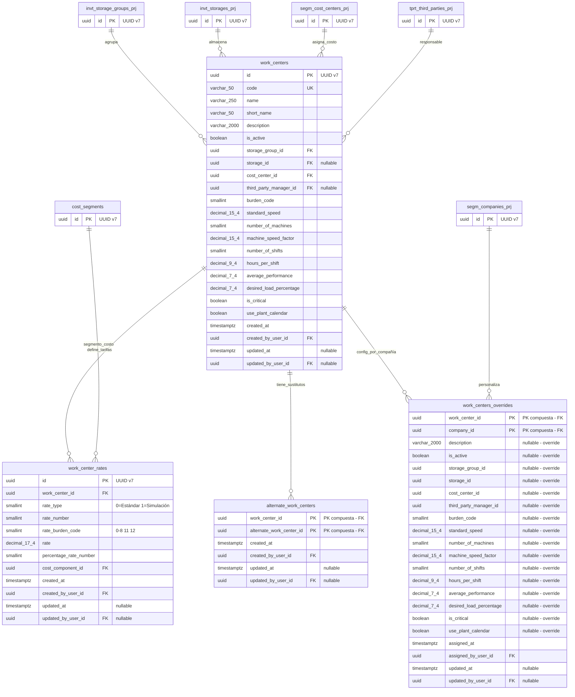

## **Documentación Funcional: Maestro de Centros de Trabajo**

**Versión:** 1.0
**Fecha:** 19 de febrero de 2026
**Producto:** Sistema ERP - Módulo de Manufactura
**Área de Negocio:** Manufactura y Producción

### Introducción al Maestro de Centros de Trabajo

El Maestro de Centros de Trabajo es el catálogo central que define las unidades productivas donde se ejecutan las operaciones de manufactura. Cada centro de trabajo representa un área de producción con capacidad definida (turnos, horas, velocidad, máquinas) y se asocia a una instalación, Almacén, centro de costo y responsable.

Este maestro es fundamental para la planificación de capacidad, costeo de producción y definición de rutas de manufactura. Un centro de trabajo puede tener centros de trabajo sustitutos (de la misma instalación), y define tarifas estándar y de simulación que se utilizan en el cálculo de costos de producción.

---

# Entidades

**Entidades Proyectadas:**    
Este feature utiliza entidades proyectadas de otros servicios (AccessManager, Segment) para referencias de campos de auditoría y compañías. El detalle completo de estas entidades (campos, tipos de dato y convención de nombres) se encuentra en el documento **[Entidades Proyectadas](../../entidades-proyectadas.md)**.

**Entidad principal:** WorkCenter (C#: `WorkCenter`)
**Tabla PostgreSQL:** `work_centers`
**Tipo de Maestro:** GLOBAL (con overrides por compañía)

> **Nota sobre IsImmutable:** En el contexto del MasterPattern, `IsImmutable = true` **no significa que el campo nunca pueda cambiar**. Significa que:
> - El campo es **GLOBAL** (aplica a todas las compañías, no puede sobrescribirse)
> - Requiere el permiso especial `UPDATE_GLOBAL` (restringido a administradores) para ser modificado
> - No aparece en la tabla `Overrides`

| Campo C# | Columna DB | Tipo de dato | IsImmutable | IsOverridable | Observación |
|---|---|---|---|---|---|
| ID | id | uuid (v7) | - | - | Primary key, generado con `Guid.CreateVersion7()` |
| Code | code | varchar(50) | ✅ Sí | ❌ No | Código único del centro de trabajo. Requiere `UPDATE_GLOBAL`. Unique index |
| Name | name | varchar(250) | ✅ Sí | ❌ No | Nombre del centro de trabajo. Requiere `UPDATE_GLOBAL` |
| ShortName | short_name | varchar(50) | ✅ Sí | ❌ No | Nombre corto del centro de trabajo. Requiere `UPDATE_GLOBAL` |
| Description | description | varchar(2000) | ❌ No | ✅ Sí | Descripción del centro de trabajo (puede sobrescribirse por compañía) |
| IsActive | is_active | bool | ❌ No | ✅ Sí | Estado activo/inactivo (puede sobrescribirse por compañía) |
| StorageGroupID | storage_group_id | uuid | ❌ No | ✅ Sí | FK a `invt_storage_groups_prj.id`. Instalación |
| StorageID | storage_id | uuid? | ❌ No | ✅ Sí | FK a `invt_storages_prj.id`. Almacén (nullable) |
| CostCenterID | cost_center_id | uuid | ❌ No | ✅ Sí | FK a `segm_cost_centers_prj.id`. Centro de costo |
| ThirdPartyManagerID | third_party_manager_id | uuid? | ❌ No | ✅ Sí | FK a `tprt_third_parties_prj.id`. Responsable (nullable). Tiene index |
| BurdenCode | burden_code | smallint | ❌ No | ✅ Sí | Código de carga de capacidad (0-5). Ver enumeración EnumBurdenCode |
| StandardSpeed | standard_speed | decimal(15,4) | ❌ No | ✅ Sí | Velocidad estándar del centro de trabajo (puede sobrescribirse por compañía) |
| NumberOfMachines | number_of_machines | smallint | ❌ No | ✅ Sí | Cantidad de máquinas (calculado automáticamente) |
| MachineSpeedFactor | machine_speed_factor | decimal(15,4) | ❌ No | ✅ Sí | Factor velocidad máquinas (calculado) |
| NumberOfShifts | number_of_shifts | smallint | ❌ No | ✅ Sí | Número de turnos por día |
| HoursPerShift | hours_per_shift | decimal(9,4) | ❌ No | ✅ Sí | Horas por turno |
| AveragePerformance | average_performance | decimal(7,4) | ❌ No | ✅ Sí | Rendimiento medio (%) |
| DesiredLoadPercentage | desired_load_percentage | decimal(7,4) | ❌ No | ✅ Sí | Porcentaje de carga deseada (%) |
| IsCritical | is_critical | bool | ❌ No | ✅ Sí | Indica si el centro de trabajo es crítico |
| UsePlantCalendar | use_plant_calendar | bool | ❌ No | ✅ Sí | Indica si usa el calendario de planta |
| CreatedAt | created_at | DateTimeOffset | - | - | Fecha de creación del registro |
| CreatedByUserID | created_by_user_id | uuid | - | - | FK a `amgr_users_prj.id`. Usuario de creación |
| UpdatedAt | updated_at | DateTimeOffset? | - | - | Fecha de última actualización del registro |
| UpdatedByUserID | updated_by_user_id | uuid? | - | - | FK a `amgr_users_prj.id`. Usuario de última actualización |

**Entidad detalle 1:** WorkCenterRate (C#: `WorkCenterRate`)
**Tabla PostgreSQL:** `work_center_rates`

| Campo C# | Columna DB | Tipo de dato | Observación |
|---|---|---|---|
| ID | id | uuid (v7) | Primary key, generado con `Guid.CreateVersion7()` |
| WorkCenterID | work_center_id | uuid | FK a `work_centers.id` |
| RateType | rate_type | smallint | Tipo de tarifa: 0=Estándar, 1=Simulación |
| RateNumber | rate_number | smallint | Número de tarifa (secuencial) |
| RateBurdenCode | rate_burden_code | smallint | Código de carga de la tarifa (0-8, 11, 12). Ver EnumRateBurdenCode |
| Rate | rate | decimal(17,4) | Valor de la tarifa. Overwrite: Yes |
| PercentageRateNumber | percentage_rate_number | smallint | Número de tarifa de porcentaje (referencia a otra tarifa) |
| CostSgmentID | cost_segment_id | uuid | FK a `invt_cost_segments_prj.id`. Segmento de costo. Overwrite: Yes |
| CreatedAt | created_at | DateTimeOffset | Fecha de creación del registro |
| CreatedByUserID | created_by_user_id | uuid | FK a `amgr_users_prj.id` |
| UpdatedAt | updated_at | DateTimeOffset? | Fecha de última actualización |
| UpdatedByUserID | updated_by_user_id | uuid? | FK a `amgr_users_prj.id` |

> **Índice único:** `(work_center_id, rate_type, rate_number)` - Garantiza que no se repita la combinación de centro de trabajo, tipo de tarifa y número de tarifa.

**Entidad detalle 2:** AlternateWorkCenter (C#: `AlternateWorkCenter`)
**Tabla PostgreSQL:** `alternate_work_centers`

| Campo C# | Columna DB | Tipo de dato | Observación |
|---|---|---|---|
| WorkCenterID | work_center_id | uuid | PK compuesta, FK a `work_centers.id`. Centro de trabajo principal |
| AlternateWorkCenterID | alternate_work_center_id | uuid | PK compuesta, FK a `work_centers.id`. Centro de trabajo sustituto. Overwrite: Yes |
| CreatedAt | created_at | DateTimeOffset | Fecha de creación |
| CreatedByUserID | created_by_user_id | uuid | FK a `amgr_users_prj.id` |
| UpdatedAt | updated_at | DateTimeOffset? | Fecha de última actualización |
| UpdatedByUserID | updated_by_user_id | uuid? | FK a `amgr_users_prj.id` |

**Entidad Overrides:** WorkCenterOverrides (C#: `WorkCenterOverrides`)
**Tabla PostgreSQL:** `work_centers_overrides`
**Relación:** Configuración y overrides de centro de trabajo específicos por compañía (clave compuesta)

> **Patrón MasterPattern:** Esta tabla sigue el patrón de Overrides para maestros GLOBAL. La clave primaria es compuesta `(work_center_id, company_id)`. Los campos con `IsOverridable` son nullable y siguen la regla: NULL = hereda del base, NOT NULL = usa el override.

| Campo C# | Columna DB | Tipo de dato | Tipo Campo | Observación |
|---|---|---|---|---|
| WorkCenterID | work_center_id | uuid | PK, FK | FK a `work_centers.id` (parte de clave compuesta) |
| CompanyID | company_id | uuid | PK, FK | FK a `segm_companies_prj.id` (parte de clave compuesta) |
| Description | description | varchar(2000)? | IsOverridable | Override de la descripción. NULL = hereda del base |
| IsActive | is_active | bool? | IsOverridable | Override del estado. NULL = hereda del base |
| StorageGroupID | storage_group_id | uuid? | IsOverridable | Override de la instalación. NULL = hereda del base |
| StorageID | storage_id | uuid? | IsOverridable | Override del almacén. NULL = hereda del base |
| CostCenterID | cost_center_id | uuid? | IsOverridable | Override del centro de costo. NULL = hereda del base |
| ThirdPartyManagerID | third_party_manager_id | uuid? | IsOverridable | Override del responsable. NULL = hereda del base |
| BurdenCode | burden_code | smallint? | IsOverridable | Override del código de carga. NULL = hereda del base |
| StandardSpeed | standard_speed | decimal(15,4)? | IsOverridable | Override de la velocidad estándar. NULL = hereda del base |
| NumberOfMachines | number_of_machines | smallint? | IsOverridable | Override de número de máquinas. NULL = hereda del base |
| MachineSpeedFactor | machine_speed_factor | decimal(15,4)? | IsOverridable | Override del factor velocidad. NULL = hereda del base |
| NumberOfShifts | number_of_shifts | smallint? | IsOverridable | Override de turnos. NULL = hereda del base |
| HoursPerShift | hours_per_shift | decimal(9,4)? | IsOverridable | Override de horas por turno. NULL = hereda del base |
| AveragePerformance | average_performance | decimal(7,4)? | IsOverridable | Override del rendimiento medio. NULL = hereda del base |
| DesiredLoadPercentage | desired_load_percentage | decimal(7,4)? | IsOverridable | Override de carga deseada. NULL = hereda del base |
| IsCritical | is_critical | bool? | IsOverridable | Override del indicador crítico. NULL = hereda del base |
| UsePlantCalendar | use_plant_calendar | bool? | IsOverridable | Override del calendario planta. NULL = hereda del base |
| AssignedAt | assigned_at | DateTimeOffset | - | Fecha de asignación del centro de trabajo a la compañía |
| AssignedByUserID | assigned_by_user_id | uuid | - | FK a `amgr_users_prj.id`. Usuario que asignó |
| UpdatedAt | updated_at | DateTimeOffset? | - | Fecha de última modificación de la configuración |
| UpdatedByUserID | updated_by_user_id | uuid? | - | FK a `amgr_users_prj.id`. Usuario de última modificación |

# Diagrama de Modelo Entidad-Relación (MER)



## Endpoint Search (Backend)

> **Nota:** Para que el componente **LookupField** pueda consumir esta entidad desde otros maestros (ej: Máquinas, Rutas de Operación), se debe implementar el endpoint `Search`. Este endpoint utiliza la librería `Siesa.BusinessUtilities.LookupFieldQueryBuilder` y sigue el patrón estándar de búsqueda para componentes de selección.

---

## Campos con Control LookupField (Frontend)

> **Nota sobre controles de entidad:** Los campos que son llaves foráneas (FK) a otras entidades y que **el usuario selecciona en la interfaz** se implementarán utilizando el componente **LookupField**. Este control permite buscar, filtrar y seleccionar registros de entidades relacionadas de forma estandarizada.
>
> **Importante:** Las FK internas (como `WorkCenterID` en `WorkCenterRate`, `AlternateWorkCenter` y `WorkCenterOverrides`, o `CompanyID` en `WorkCenterOverrides`) no requieren LookupField ya que se asignan automáticamente por contexto del maestro padre o de la sesión del usuario.

**Campos que requieren LookupField:**

| Campo | Entidad Relacionada | Tabla Relacionada | Comportamiento |
|-------|-------------------|-------------------|----------------|
| StorageGroupID | StorageGroup | `invt_storage_groups_prj` | Seleccionar instalación. **Al cambiar, se debe limpiar StorageID** ya que el almacén depende de la instalación |
| StorageID | Storage | `invt_storages_prj` | Seleccionar almacén. **Solo habilitado cuando StorageGroupID tiene valor**. Filtra almacenes por la instalación seleccionada. Campo opcional |
| CostCenterID | CostCenter | `segm_cost_centers_prj` | Seleccionar centro de costo |
| ThirdPartyManagerID | ThirdParty | `tprt_third_parties_prj` | Seleccionar responsable/tercero. Campo opcional |
| AlternateWorkCenterID | WorkCenter | `work_centers` | En la grilla de sustitutos: seleccionar centro de trabajo sustituto. **Debe pertenecer a la misma instalación (StorageGroupID)** |
| CostSegmentID | CostSegment | `invt_cost_segments_prj` | En la grilla de tarifas: seleccionar segmento de costo |

---

## Implementación del Patrón GLOBAL + Override

> **Nota:** Este maestro implementa el patrón **GLOBAL + Override** utilizando la librería `ERP.MasterPattern`. El servicio debe extender `BaseMasterService<WorkCenter>` para heredar la lógica de resolución de overrides.

### Campos Sobrescribibles por Compañía

| Campo | ¿Sobrescribible? | Observación |
|-------|------------------|-------------|
| `Code` | ❌ No | Inmutable - Identifica al centro de trabajo globalmente |
| `Name` | ❌ No | Inmutable - Nombre oficial |
| `ShortName` | ❌ No | Inmutable - Nombre corto |
| `Description` | ✅ Sí | Cada compañía puede personalizar la descripción |
| `IsActive` | ✅ Sí | Cada compañía puede activar/desactivar independientemente |
| `StorageGroupID` | ✅ Sí | Cada compañía puede asignar diferente instalación |
| `StorageID` | ✅ Sí | Cada compañía puede asignar diferente almacén |
| `CostCenterID` | ✅ Sí | Cada compañía puede asignar diferente centro de costo |
| `ThirdPartyManagerID` | ✅ Sí | Cada compañía puede asignar diferente responsable |
| `BurdenCode` | ✅ Sí | Cada compañía puede personalizar el código de carga |
| `StandardSpeed` | ✅ Sí | Cada compañía puede personalizar la velocidad estándar |
| `NumberOfMachines` | ✅ Sí | Calculado automáticamente desde máquinas activas |
| `MachineSpeedFactor` | ✅ Sí | Calculado automáticamente |
| `NumberOfShifts` | ✅ Sí | Cada compañía puede personalizar turnos |
| `HoursPerShift` | ✅ Sí | Cada compañía puede personalizar horas por turno |
| `AveragePerformance` | ✅ Sí | Cada compañía puede personalizar rendimiento |
| `DesiredLoadPercentage` | ✅ Sí | Cada compañía puede personalizar carga deseada |
| `IsCritical` | ✅ Sí | Cada compañía puede marcar como crítico independientemente |
| `UsePlantCalendar` | ✅ Sí | Cada compañía puede decidir usar calendario planta |

### Configuración en WorkCenterDefinition

```csharp
public static readonly MasterDefinition DEFINITION = new()
{
    Name = "WorkCenter",
    Type = MasterType.GLOBAL,
    OverridesTableName = "work_centers_overrides",
    Fields =
    [
        new FieldDefinition { FieldName = "Code", IsOverridable = false, IsImmutable = true },
        new FieldDefinition { FieldName = "Name", IsOverridable = false, IsImmutable = true },
        new FieldDefinition { FieldName = "ShortName", IsOverridable = false, IsImmutable = true },
        new FieldDefinition { FieldName = "Description", IsOverridable = true, IsImmutable = false },
        new FieldDefinition { FieldName = "IsActive", IsOverridable = true, IsImmutable = false },
        new FieldDefinition { FieldName = "StorageGroupID", IsOverridable = true, IsImmutable = false },
        new FieldDefinition { FieldName = "StorageID", IsOverridable = true, IsImmutable = false },
        new FieldDefinition { FieldName = "CostCenterID", IsOverridable = true, IsImmutable = false },
        new FieldDefinition { FieldName = "ThirdPartyManagerID", IsOverridable = true, IsImmutable = false },
        new FieldDefinition { FieldName = "BurdenCode", IsOverridable = true, IsImmutable = false },
        new FieldDefinition { FieldName = "StandardSpeed", IsOverridable = true, IsImmutable = false },
        new FieldDefinition { FieldName = "NumberOfMachines", IsOverridable = true, IsImmutable = false },
        new FieldDefinition { FieldName = "MachineSpeedFactor", IsOverridable = true, IsImmutable = false },
        new FieldDefinition { FieldName = "NumberOfShifts", IsOverridable = true, IsImmutable = false },
        new FieldDefinition { FieldName = "HoursPerShift", IsOverridable = true, IsImmutable = false },
        new FieldDefinition { FieldName = "AveragePerformance", IsOverridable = true, IsImmutable = false },
        new FieldDefinition { FieldName = "DesiredLoadPercentage", IsOverridable = true, IsImmutable = false },
        new FieldDefinition { FieldName = "IsCritical", IsOverridable = true, IsImmutable = false },
        new FieldDefinition { FieldName = "UsePlantCalendar", IsOverridable = true, IsImmutable = false }
    ]
};
```

---

### Enumeraciones

**EnumBurdenCode** (BurdenCode en work_centers)

| Valor | Nombre | Descripción |
|-------|--------|-------------|
| 0 | NoHours | Sin horas |
| 1 | MachineHours | Horas máquina |
| 2 | PreparationHours | Horas alistamiento |
| 3 | PreparationAndMachineHours  | Horas alistamiento y máquina |
| 4 | ManHours  | Horas hombre |
| 5 | PreparationAndManHours | Horas alistamiento y hombre |

**EnumRateType** (RateType en work_center_rates)

| Valor | Nombre | Descripción |
|-------|--------|-------------|
| 0 | Standard | Tarifa estándar |
| 1 | Simulation | Tarifa de simulación |

**EnumRateBurdenCode** (RateBurdenCode en work_center_rates)

| Valor | Nombre | Descripción |
|-------|--------|-------------|
| -1 | NotApplicable | No aplica |
| 0 | NoHours | Sin horas |
| 1 | MachineHours | Horas máquina |
| 2 | PreparationHours | Horas alistamiento |
| 3 | PreparationAndMachineHours | Horas alistamiento y máquina |
| 4 | ManHours | Horas hombre |
| 5 | PreparationAndManHours | Horas alistamiento y hombre |
| 6 | ManHoursAndMachineHours | Horas hombre y máquina |
| 7 | IndirectHours | Horas indirectas |
| 8 | SetupHoursManhoursAndMachineHours | Horas alistamiento, hombre y máquina |
| 11 | PercentageOnOneLine | Porcentaje sobre una línea |
| 12 | PercentageOnOtherLines | Porcentaje sobre las demás líneas |

---

### Estructura General del Maestro

Es un maestro complejo de manufactura que consta de seis secciones principales organizadas en pestañas:

1. **Generales (Cabecera):** Datos de identificación, instalación, almacén, centro de costo, responsable y código de carga.
2. **Capacidad:** Parámetros de capacidad productiva: velocidad estándar, número de máquinas, factor de velocidad, turnos, horas, rendimiento y carga deseada. Incluye campos calculados.
3. **Tarifas Estándar:** Grilla de tarifas tipo estándar con código de carga, valor, porcentaje y segmento de costo.
4. **Tarifas Simulación:** Grilla de tarifas tipo simulación con la misma estructura que las estándar.
5. **Sustitutos:** Grilla de centros de trabajo sustitutos (deben pertenecer a la misma instalación).
6. **Descripción:** Campo de texto libre para observaciones adicionales.

---

### 1. Vista de Lista

La vista de lista presenta todos los centros de trabajo registrados en el sistema con las siguientes características:

**Columnas visibles:**

| Columna | Campo | Descripción |
|---------|-------|-------------|
| Centro de trabajo | code | Identificador alfanumérico del centro de trabajo |
| Nombre | name | Nombre del centro de trabajo |
| Nombre Corto | short_name | Nombre corto del centro de trabajo |
| Estado | is_active | Indicador visual de estado (Activo/Inactivo) |
| Instalación | storage_group_id | Instalación |
| Crítico | is_critical | Indicador si el centro es crítico |

**Paginación:** 10, 20, 50, 100 registros por página

**Acciones disponibles por registro:**
- **Editar:** Abre el formulario de edición del centro de trabajo
- **Ver:** Abre el detalle del centro de trabajo en modo solo lectura
- **Asignar compañía:** Permite asignar el centro de trabajo a una o más compañías que el usuario tiene asignadas
- **Eliminar:** Elimina el registro (requiere confirmación y validación de dependencias)

---

### 2. Búsqueda y Filtros

La vista de lista incluye funcionalidades de búsqueda y filtrado para facilitar la localización de registros:

**Búsqueda general:**
- Campo de texto que permite buscar por coincidencia parcial en Código o Nombre
- La búsqueda no distingue entre mayúsculas y minúsculas

**Filtros por columna:**

| Columna | Tipo de Filtro | Descripción |
|---------|----------------|-------------|
| Centro de trabajo | Texto | Filtra por coincidencia parcial en el código |
| Nombre | Texto | Filtra por coincidencia parcial en el nombre |
| Estado | Selección | Filtra por estado: Todos, Activo, Inactivo |
| Instalación | Selección/LookupField | Filtra por instalación específica |
| Crítico | Selección | Filtra por indicador crítico: Todos, Sí, No |
| Código Carga | Selección | Filtra por código de carga: Todos, Sin horas, Horas máquina, Horas alistamiento, Horas alistamiento y máquina, Horas hombre, Horas alistamiento y hombre |

**Ordenamiento:**
- Por defecto: Ordenado por Código (ascendente)
- El usuario puede ordenar por cualquier columna haciendo clic en el encabezado
- Soporta ordenamiento ascendente y descendente

---

### 3. Comportamiento del Formulario (Creación vs Edición)

Esta sección describe cómo se comporta el formulario del maestro de centros de trabajo según el modo de operación, aplicando el patrón **GLOBAL con overrides** del MasterPattern.

#### **3.1. Modo Creación**

Al crear un nuevo centro de trabajo:

* **Contexto:** El registro siempre se crea en la **tabla base GLOBAL** (`work_centers`).
* **Selector de Compañía:** **No se muestra.** No existe opción para seleccionar compañía porque la creación es exclusivamente global.
* **Campos Visibles:**
    * **Campos IsImmutable:** Código, Nombre, Nombre Corto
    * **Campos IsOverridable:** Descripción, Estado, Instalación, Almacén, Centro de Costo, Responsable, Código de Carga, Velocidad Estándar, Número de Turnos, Horas por Turno, Rendimiento Medio, Porcentaje Carga Deseada, Indicador Crítico, Indicador Calendario Planta
* **Valores por defecto:**
    * Estado: Activo (true)
    * Código de Carga: Sin Horas (0)
    * Velocidad Estándar: 1
    * Número de Turnos: 0
    * Horas por Turno: 8
    * Rendimiento Medio: 100
    * Porcentaje Carga Deseada: 100
    * Indicador Crítico: No (false)
    * Indicador Calendario Planta: No (false)
* **Permisos Requeridos:** `manufacturing.work_centers.create`

* **Flujo Post-Guardado:**
    1. Al guardar exitosamente el registro, el sistema presenta automáticamente el diálogo de **Asignación de Compañías**
    2. El usuario puede seleccionar una o más compañías de las que tiene asignadas para asociar el centro de trabajo
    3. La asignación es opcional; el usuario puede omitir este paso y asignar compañías posteriormente desde la Vista de Lista

#### **3.2. Modo Edición**

Al editar un centro de trabajo existente, el usuario debe seleccionar el contexto de edición:

* **Selector de Contexto:** Se presenta un control que permite elegir entre:
    * **Global:** Edita los campos de la tabla base (`work_centers`)
    * **Compañía [Nombre]:** Edita la configuración específica de una compañía (`work_centers_overrides`). Solo se muestran las compañías asignadas al usuario donde el centro de trabajo también está asignado.

##### **3.2.1. Edición en Contexto GLOBAL**

* **Disponibilidad:** Solo visible si el usuario tiene el permiso `manufacturing.work_centers.update_global`
* **Campos Editables:** Code, Name, ShortName (campos inmutables de la tabla base) y todos los campos IsOverridable (incluyendo StandardSpeed)
* **Impacto:** Los cambios afectan a **todas las compañías** que no tengan overrides específicos
* **Restricción Instalación:** Si el centro de trabajo existe en rutas de operación, **no se puede cambiar la Instalación (StorageGroupID)**
* **Permisos Requeridos:** `manufacturing.work_centers.update_global`

##### **3.2.2. Edición en Contexto de Compañía**

* **Disponibilidad:** Solo para compañías donde el centro de trabajo ha sido asignado previamente
* **Campos Visibles:**
    * **Campos IsImmutable (solo lectura):** Código, Nombre, Nombre Corto - se muestran pero no son editables
    * **Campos IsOverridable (editables):** Descripción, Estado, Instalación, Almacén, Centro de Costo, Responsable, Código de Carga, Velocidad Estándar, Número de Máquinas, Factor Velocidad, Número de Turnos, Horas por Turno, Rendimiento Medio, Porcentaje Carga Deseada, Indicador Crítico, Indicador Calendario Planta
* **Permisos Requeridos:** `manufacturing.work_centers.update`

#### **3.3. Modo Solo Lectura (Ver)**

* **Selector de Contexto:** Se presenta igual que en modo edición, permitiendo alternar entre la vista global y las configuraciones por compañía
* **Campos:** Todos los campos se muestran deshabilitados
* **Permisos Requeridos:** `manufacturing.work_centers.read`

---

### 4. Sección: Generales (Cabecera)

Esta sección describe los campos del formulario principal que se presenta al crear o editar un centro de trabajo.

* **Campo: Centro de trabajo**
    * **Propósito:** Es el identificador único para el centro de trabajo dentro del sistema.
    * **Comportamiento:** Se ingresa un valor alfanumérico.
    * **Reglas de Negocio:**
        * **Obligatorio:** El código es requerido para guardar el registro.
        * **Único:** No pueden existir dos centros de trabajo con el mismo código.
        * **Auto-llenado nombre corto:** Al perder el foco en el campo Nombre, el sistema auto-llena el Nombre Corto con los primeros caracteres del Nombre si el Nombre Corto está vacío.

* **Campo: Nombre**
    * **Propósito:** Nombre completo del centro de trabajo.
    * **Comportamiento:** Se ingresa texto libre.
    * **Reglas de Negocio:**
        * **Obligatorio:** El nombre es requerido.

* **Campo: Nombre Corto**
    * **Propósito:** Nombre abreviado del centro de trabajo para visualización en listas y reportes.
    * **Comportamiento:** Se ingresa texto libre. Se auto-llena desde el Nombre.
    * **Reglas de Negocio:**
        * **Obligatorio:** El nombre corto es requerido.

* **Campo: Estado**
    * **Propósito:** Indica si el centro de trabajo está activo y puede ser utilizado en operaciones de manufactura.
    * **Comportamiento:** Se selecciona: **Activo** o **Inactivo**.

* **Campo: Instalación (StorageGroupID)**
    * **Propósito:** Define la instalación a la que pertenece el centro de trabajo.
    * **Comportamiento:** Se selecciona mediante LookupField.
    * **Reglas de Negocio:**
        * **Obligatorio:** La instalación es requerida.
        * **Dependencia Almacén:** Al cambiar la instalación, se limpia el campo Almacén.
        * **Restricción por rutas:** Si el centro de trabajo está asignado a rutas de operación, la instalación no se puede modificar.

* **Campo: Almacén (StorageID)**
    * **Propósito:** Almacén asociada al centro de trabajo dentro de la instalación.
    * **Comportamiento:** Se selecciona mediante LookupField. Solo habilitado cuando hay una instalación seleccionada.
    * **Reglas de Negocio:**
        * **Opcional:** El Almacén no es obligatorio.
        * **Misma instalación:** El Almacén debe pertenecer a la misma instalación del centro de trabajo.
        * **Mismo C.O.:** Si hay centro de costo seleccionado, el Almacén debe pertenecer al mismo Centro Operativo que el centro de costo.

* **Campo: Centro de Costo (CostCenterID)**
    * **Propósito:** Centro de costo contable al que se cargan los costos de este centro de trabajo.
    * **Comportamiento:** Se selecciona mediante LookupField.
    * **Reglas de Negocio:**
        * **Obligatorio:** El centro de costo es requerido.
        * **Debe existir:** El centro de costo seleccionado debe existir en el sistema.

* **Campo: Responsable (ThirdPartyManagerID)**
    * **Propósito:** Tercero responsable del centro de trabajo.
    * **Comportamiento:** Se selecciona mediante LookupField.
    * **Reglas de Negocio:**
        * **Opcional:** El responsable no es obligatorio.

* **Campo: Código de Carga (BurdenCode)**
    * **Propósito:** Define el tipo de carga de capacidad del centro de trabajo.
    * **Comportamiento:** Se selecciona de una lista desplegable con los valores de EnumBurdenCode.

---

### 5. Sección: Capacidad

Esta sección permite configurar los parámetros de capacidad productiva del centro de trabajo.

* **Campo: Velocidad Estándar (StandardSpeed)**
    * **Propósito:** Define la velocidad estándar de producción.
    * **Reglas de Negocio:**
        * El valor debe ser >= 1.

* **Campo: Número de Máquinas (NumberOfMachines)**
    * **Propósito:** Cantidad de máquinas activas en el centro de trabajo.
    * **Comportamiento:** Campo calculado automáticamente basado en las máquinas activas registradas en el maestro de máquinas.

* **Campo: Factor de Velocidad de Máquinas (MachineSpeedFactor)**
    * **Propósito:** Factor que relaciona la velocidad de las máquinas con la velocidad estándar.
    * **Comportamiento:** Campo calculado automáticamente.
    * **Fórmula:** `Sum(MachineSpeed * AverageEfficiency / 100) / StandardSpeed`, redondeado a 2 decimales. Si no hay máquinas activas, el factor es 1.

* **Campo: Número de Turnos (NumberOfShifts)**
    * **Propósito:** Cantidad de turnos de trabajo por día.
    * **Reglas de Negocio:**
        * El valor no puede ser negativo.

* **Campo: Horas por Turno (HoursPerShift)**
    * **Propósito:** Cantidad de horas de trabajo por turno.
    * **Reglas de Negocio:**
        * El valor debe ser >= 1.

* **Campo: Rendimiento Medio (AveragePerformance)**
    * **Propósito:** Porcentaje de rendimiento promedio del centro de trabajo.
    * **Reglas de Negocio:**
        * El valor no puede ser negativo.

* **Campo: Porcentaje de Carga Deseada (DesiredLoadPercentage)**
    * **Propósito:** Porcentaje de carga deseada para planificación de capacidad.
    * **Reglas de Negocio:**
        * El valor no puede ser negativo.

* **Campo: Indicador Crítico (IsCritical)**
    * **Propósito:** Marca si el centro de trabajo es un recurso crítico para planificación.
    * **Comportamiento:** Checkbox.

* **Campo: Indicador Calendario Planta (UsePlantCalendar)**
    * **Propósito:** Indica si el centro de trabajo utiliza el calendario de planta para planificación.
    * **Comportamiento:** Checkbox.

**Campos Calculados (solo lectura, mostrados en la sección Capacidad):**

| Campo Calculado | Fórmula | Descripción |
|-----------------|---------|-------------|
| Horas por Día | `NumberOfShifts × HoursPerShift` | Total de horas productivas por día |
| Capacidad Diaria | `MachineSpeedFactor × HorasPorDía` | Capacidad bruta diaria |
| Capacidad Disponible | `DailyCapacity × (AveragePerformance / 100) × (DesiredLoadPercentage / 100)` | Capacidad real disponible |

---

### 6. Sección: Tarifas Estándar / Tarifas Simulación

Cada centro de trabajo puede tener múltiples tarifas organizadas en dos tipos: **Estándar** (RateType=0) y **Simulación** (RateType=1). Ambas secciones comparten la misma estructura.

* **Grilla de Tarifas**
    * **Propósito:** Definir las tarifas de costo asociadas al centro de trabajo.
    * **Columnas:**
        * **Nro. Tarifa (RateNumber):** Número secuencial de la tarifa.
        * **Código Carga (RateBurdenCode):** Tipo de carga de la tarifa. Selección de EnumRateBurdenCode.
        * **Valor Tarifa (Rate):** Valor monetario de la tarifa.
        * **Tarifa Porcentaje (PercentageRateNumber):** Referencia al número de tarifa sobre la que se calcula el porcentaje.
        * **Segmento de Costo (CostComponentID):** Selección mediante LookupField.
    * **Comportamiento:** Tabla de tipo "maestro-detalle" donde el usuario puede agregar, editar o eliminar tarifas.

**Reglas de Validación de Tarifas:**
1. Si el código de carga es **NoAplica (-1)**: El valor de la tarifa se establece en 0 y el segmento no aplica.
2. Si el código de carga está entre **SinHoras (0) y PesoTeorico (10)**: El porcentaje debe ser 0 (no aplica) y el segmento de costo es obligatorio.
3. Si el código de carga es **PorcentajeLinea (11)**: No puede ser la primera tarifa. El porcentaje debe referenciar una tarifa anterior (mayor a 0 y menor al número de tarifa actual). El segmento de costo es obligatorio. No puede existir después de una tarifa con PorcentajeTodas.
4. Si el código de carga es **PorcentajeTodas (12)**: Solo puede existir una tarifa con este código. El segmento de costo es obligatorio.
5. El valor de la tarifa no puede ser 0 (excepto cuando el código de carga es NoAplica).
6. Para tarifas de porcentaje (11, 12): El valor de la tarifa debe ser menor a 999.
7. Si el segmento de costo tiene indicador NIIF = 0: El valor de la tarifa no puede ser negativo.

**Funcionalidad: Transferir Tarifas**
- Permite copiar las tarifas de un tipo (origen) a otro tipo (destino) para uno o varios centros de trabajo de una instalación.
- **Permiso requerido:** `manufacturing.work_centers.edit_rates`
- **Comportamiento:** Elimina las tarifas destino existentes y copia las tarifas origen al destino.

---

### 7. Sección: Sustitutos

* **Grilla de Sustitutos**
    * **Propósito:** Definir centros de trabajo alternativos que pueden reemplazar al actual en la planificación de producción.
    * **Columnas:**
        * **Código:** Código del centro de trabajo sustituto.
        * **Descripción:** Nombre del centro de trabajo sustituto.
    * **Comportamiento:** Tabla de tipo "maestro-detalle" donde el usuario puede agregar o eliminar sustitutos.

**Reglas de Validación de Sustitutos:**
1. El sustituto no puede ser igual al centro de trabajo principal.
2. El sustituto debe pertenecer a la misma instalación (StorageGroupID) del centro de trabajo principal.
3. No puede existir la misma tupla (centro de trabajo, sustituto) duplicada.

**Restricción sobre Instalación:**
- Si el centro de trabajo tiene sustitutos registrados, la instalación del centro de trabajo **no se puede modificar** desde la interfaz.

---

### 8. Sección: Descripción

* **Campo: Descripción**
    * **Propósito:** Permite añadir observaciones o detalles adicionales sobre el centro de trabajo.
    * **Comportamiento:** Campo opcional de texto libre.

---

## 9. Dependencias con Otros Maestros

El centro de trabajo es referenciado por múltiples entidades del sistema. Antes de eliminar un centro de trabajo, se debe verificar que no exista en:

| Entidad Dependiente | Tabla | Validación |
|---------------------|-------------|------------|
| Máquinas | `machines` | Si existe → No se puede eliminar. Error: "El centro de trabajo existe en el maestro de máquinas" |
| Rutas de Operación | `routing_operations` | Si existe → No se puede eliminar ni cambiar instalación. Error: "El centro de trabajo existe en el maestro de rutas" |


---

## 10. Fórmula de Cálculo del Factor de Velocidad

El factor de velocidad de máquinas se calcula automáticamente en el servidor:

1. Se cuentan las máquinas activas (`ind_estado = 1`) del centro de trabajo.
2. Si hay máquinas activas:
   - `SumFactors = Sum(StandardMachineSpeed * AverageEfficiency / 100)` para todas las máquinas activas
   - `SpeedFactor = Round(SumFactors / StandardSpeedCT, 2)`
3. Si no hay máquinas activas: `SpeedFactor = 1`
4. Se actualiza el número de máquinas y el factor en el centro de trabajo.
5. Si el factor de velocidad resulta <= 0, se genera error.

---

## 11. Sistema de Permisos (RBAC)

> **Referencia:** La implementación de permisos sigue el estándar definido en **Access Manager**.

Este maestro implementa el sistema de control de acceso basado en roles (**RBAC**) mediante el servicio centralizado **Access Manager**. Cada operación debe validar los permisos del usuario antes de ejecutarse.

### Permisos del Maestro de Centros de Trabajo

| Permiso | Código | Descripción |
|---------|--------|-------------|
| Consultar | `manufacturing.work_centers.read` | Ver lista y detalle de centros de trabajo |
| Crear | `manufacturing.work_centers.create` | Crear nuevos centros de trabajo |
| Actualizar | `manufacturing.work_centers.update` | Modificar campos editables (overrides por compañía) |
| Actualizar Global | `manufacturing.work_centers.update_global` | Modificar campos **inmutables** (Code, Name, ShortName). Restringido a administradores |
| Cambiar Estado | `manufacturing.work_centers.change_status` | Activar o desactivar centros de trabajo |
| Eliminar | `manufacturing.work_centers.delete` | Eliminar centros de trabajo sin dependencias |
| Asignar | `manufacturing.work_centers.assign` | Asignar/desasignar centros de trabajo a compañías |

### Permisos de Tarifas

| Permiso | Código | Descripción |
|---------|--------|-------------|
| Consultar Tarifas | `manufacturing.work_center_rates.read` | Ver tarifas del centro de trabajo |
| Editar Tarifas | `manufacturing.work_center_rates.update` | Agregar, modificar o eliminar tarifas. También requerido para transferir tarifas |

---

## **NOTAS IMPORTANTES:**

- Los centros de trabajo son el catálogo central de unidades productivas de manufactura
- Las tarifas (estándar y simulación) definen los costos por tipo de carga para costeo de producción
- Los sustitutos permiten planificación alternativa cuando un centro de trabajo no está disponible
- El patrón GLOBAL + Override permite personalizar la mayoría de campos por compañía, excepto Código, Nombre y Nombre Corto
- Se recomienda inactivar en lugar de eliminar centros de trabajo con historial de producción
- El número de máquinas y factor de velocidad se calculan automáticamente desde el maestro de máquinas
- **Todos los endpoints deben validar permisos usando Access Manager antes de ejecutar operaciones**
- **La concurrencia se maneja mediante PostgreSQL xMin** (ver criterios de aceptación)

---

# Criterios de Aceptación

## 1. CREACIÓN Y GESTIÓN DE CENTROS DE TRABAJO

### Criterios de Aceptación:

**AC-001: Creación con campos obligatorios**
- **Dado que** estoy creando un nuevo centro de trabajo
- **Cuando** intento guardar sin código, nombre, nombre corto, instalación o centro de costo
- **Entonces** el sistema debe mostrar errores de validación y no permitir guardar

**AC-002: Validación de código único**
- **Dado que** ingreso un código ya existente
- **Cuando** intento guardar
- **Entonces** el sistema debe mostrar error: "El código ya existe"

**AC-003: Creación exitosa con valores por defecto**
- **Dado que** completo los campos obligatorios (código, nombre, nombre corto, instalación, centro de costo)
- **Cuando** presiono guardar
- **Entonces** el sistema debe crear el registro con los valores por defecto: Estado=Activo, CódigoCarga=SinHoras, VelocidadEstándar=1, NumTurnos=0, HorasTurno=8, RendMedio=100, CargaDeseada=100, Crítico=No, CalendarioPlanta=No

**AC-004: Edición de centro de trabajo existente**
- **Dado que** selecciono editar un centro de trabajo existente
- **Cuando** modifico campos permitidos y guardo
- **Entonces** el sistema debe actualizar el registro y mostrar confirmación

**AC-005: Auto-llenado de nombre corto**
- **Dado que** estoy creando un centro de trabajo y el nombre corto está vacío
- **Cuando** pierdo el foco del campo nombre
- **Entonces** el sistema debe auto-llenar el nombre corto con los primeros caracteres del nombre

**AC-006: Duplicar centro de trabajo**
- **Dado que** selecciono duplicar un centro de trabajo existente
- **Cuando** ingreso un nuevo código único y confirmo
- **Entonces** el sistema debe crear un nuevo centro de trabajo con los mismos datos y copiar sus tarifas
- **Y** requiere el permiso `manufacturing.work_centers.duplicate`

---

## 2. GESTIÓN DE INSTALACIÓN Y ALMACÉN

### Criterios de Aceptación:

**AC-007: Dependencia Almacén-Instalación**
- **Dado que** selecciono una instalación en el campo StorageGroupID
- **Cuando** la selección se completa
- **Entonces** el campo Almacén (StorageID) se habilita y filtra los Almacénes de esa instalación

**AC-008: Limpieza de Almacén al cambiar instalación**
- **Dado que** hay un Almacén seleccionada
- **Cuando** cambio la instalación
- **Entonces** el campo Almacén se limpia y se habilita con el nuevo filtro

**AC-009: Validación Almacén misma instalación**
- **Dado que** selecciono un Almacén
- **Cuando** el Almacén no pertenece a la misma instalación del centro de trabajo
- **Entonces** el sistema debe mostrar error: "El Almacén debe pertenecer a la misma instalación del centro de trabajo"

**AC-010: Validación almacén mismo Centro Operativo que centro de costo**
- **Dado que** selecciono un almacén y un centro de costo
- **Cuando** el C.O. del almacén difiere del C.O. del centro de costo
- **Entonces** el sistema debe mostrar error: "El centro de costo debe pertenecer al mismo C.O. del almacén"

**AC-011: Restricción instalación por rutas**
- **Dado que** el centro de trabajo está asignado a rutas de operación
- **Cuando** intento cambiar la instalación
- **Entonces** el sistema debe impedir el cambio y mostrar error: "No se puede modificar la instalación de este centro de trabajo"

---

## 3. GESTIÓN DE CAPACIDAD

### Criterios de Aceptación:

**AC-012: Validación velocidad estándar**
- **Dado que** ingreso un valor de velocidad estándar
- **Cuando** el valor es menor a 1
- **Entonces** el sistema debe mostrar error de validación

**AC-013: Validación número de turnos**
- **Dado que** ingreso un valor de número de turnos
- **Cuando** el valor es negativo
- **Entonces** el sistema debe mostrar error de validación

**AC-014: Validación horas por turno**
- **Dado que** ingreso un valor de horas por turno
- **Cuando** el valor es menor a 1
- **Entonces** el sistema debe mostrar error de validación

**AC-015: Validación rendimiento medio**
- **Dado que** ingreso un valor de rendimiento medio
- **Cuando** el valor es negativo
- **Entonces** el sistema debe mostrar error de validación

**AC-016: Validación carga deseada**
- **Dado que** ingreso un valor de porcentaje de carga deseada
- **Cuando** el valor es negativo
- **Entonces** el sistema debe mostrar error de validación

**AC-017: Cálculo automático de campos de capacidad**
- **Dado que** los campos de capacidad tienen valores
- **Cuando** se muestran en la interfaz
- **Entonces** el sistema debe calcular y mostrar: HorasDía = NumTurnos × HorasTurno, CapDiaria = FactorVelocidad × HorasDía, CapDisponible = CapDiaria × (RendMedio/100) × (CargaDeseada/100)

**AC-018: Cálculo automático del factor de velocidad**
- **Dado que** se guarda un centro de trabajo
- **Cuando** tiene máquinas activas asociadas
- **Entonces** el sistema debe calcular: FactorVelocidad = Round(Sum(VelMáquina × Eficiencia/100) / VelocidadEstándar, 2) y actualizar el número de máquinas

---

## 4. GESTIÓN DE TARIFAS

### Criterios de Aceptación:

**AC-019: Agregar tarifa estándar**
- **Dado que** estoy en la sección de tarifas estándar de un centro de trabajo
- **Cuando** agrego una nueva tarifa con número, código de carga, valor y segmento de costo
- **Entonces** la tarifa debe quedar asociada al centro de trabajo con tipo Estándar (0)

**AC-020: Validación tarifa con código carga PorcentajeLinea no como primera**
- **Dado que** estoy agregando una tarifa
- **Cuando** el código de carga es PorcentajeLinea (11) y es la primera tarifa (nro=1)
- **Entonces** el sistema debe mostrar error: "El primer código de carga no puede ser de porcentajes"

**AC-021: Validación unicidad de PorcentajeTodas**
- **Dado que** ya existe una tarifa con código de carga PorcentajeTodas (12)
- **Cuando** intento agregar otra tarifa con PorcentajeTodas
- **Entonces** el sistema debe mostrar error: "No se puede asignar en varias tarifas el código de carga Porcentaje sobre las demás líneas"

**AC-022: Validación segmento de costo obligatorio**
- **Dado que** el código de carga es diferente de NoAplica
- **Cuando** no selecciono un segmento de costo
- **Entonces** el sistema debe mostrar error: "El segmento de costo es necesario para la tarifa"

**AC-023: Validación valor tarifa no cero**
- **Dado que** el código de carga es diferente de NoAplica
- **Cuando** el valor de la tarifa es 0
- **Entonces** el sistema debe mostrar error: "El valor de las tarifas deben ser diferentes de cero"

**AC-024: Transferencia de tarifas**
- **Dado que** selecciono transferir tarifas de un tipo origen a un tipo destino
- **Cuando** confirmo la transferencia
- **Entonces** el sistema debe eliminar las tarifas destino y copiar las tarifas origen al destino
- **Y** requiere el permiso `manufacturing.work_center_rates.update`

---

## 5. GESTIÓN DE SUSTITUTOS

### Criterios de Aceptación:

**AC-025: Agregar centro de trabajo sustituto**
- **Dado que** estoy en la sección de sustitutos
- **Cuando** selecciono un centro de trabajo como sustituto
- **Entonces** el sustituto debe quedar asociado al centro de trabajo principal

**AC-026: Validación sustituto diferente al principal**
- **Dado que** selecciono un sustituto
- **Cuando** el sustituto es el mismo centro de trabajo principal
- **Entonces** el sistema debe mostrar error: "El sustituto no puede ser igual al centro de trabajo"

**AC-027: Validación sustituto misma instalación**
- **Dado que** selecciono un sustituto
- **Cuando** el sustituto no pertenece a la misma instalación del centro de trabajo principal
- **Entonces** el sistema debe mostrar error: "El sustituto debe pertenecer a la misma instalación del centro de trabajo"

**AC-028: Validación sustituto duplicado**
- **Dado que** ya existe la tupla (centro de trabajo, sustituto)
- **Cuando** intento agregar el mismo sustituto
- **Entonces** el sistema debe mostrar error: "La tupla centro de trabajo - sustituto, ya existe"

---

## 6. VALIDACIONES Y PROTECCIONES

### Criterios de Aceptación:

**AC-029: Eliminación de centro de trabajo sin dependencias**
- **Dado que** un centro de trabajo no tiene máquinas, rutas ni sustitutos como dependencias
- **Cuando** intento eliminarlo y confirmo
- **Entonces** el sistema debe eliminar el centro de trabajo, sus sustitutos y sus tarifas

**AC-030: Protección de centro de trabajo con dependencias en máquinas**
- **Dado que** un centro de trabajo tiene máquinas asociadas
- **Cuando** intento eliminarlo
- **Entonces** el sistema debe impedir la eliminación y mostrar mensaje: "El centro de trabajo existe en el maestro de máquinas. No se puede eliminar"

**AC-031: Protección de centro de trabajo con dependencias en rutas**
- **Dado que** un centro de trabajo tiene rutas de operación asociadas
- **Cuando** intento eliminarlo
- **Entonces** el sistema debe impedir la eliminación y mostrar mensaje: "El centro de trabajo existe en el maestro de rutas. No se puede eliminar"

**AC-032: Protección de centro de trabajo referenciado como sustituto**
- **Dado que** un centro de trabajo es sustituto de otro centro de trabajo
- **Cuando** intento eliminarlo
- **Entonces** el sistema debe impedir la eliminación y mostrar mensaje: "El centro de trabajo es sustituto de otro centro de trabajo"

**AC-033: Desactivación de centro de trabajo**
- **Dado que** cambio el estado de un centro de trabajo a Inactivo
- **Cuando** guardo los cambios
- **Entonces** el centro de trabajo no debe aparecer en selectores para nuevas rutas u operaciones

**AC-034: Override por compañía**
- **Dado que** el centro de trabajo tiene el patrón GLOBAL + Override
- **Cuando** una compañía desactiva el centro de trabajo solo para ella
- **Entonces** las demás compañías deben seguir viendo el centro de trabajo como activo

---

## 7. CONCURRENCIA

### Criterios de Aceptación:

**AC-035: Detección de conflicto de concurrencia al modificar**
- **Dado que** el usuario A tiene abierto un centro de trabajo para edición
- **Cuando** el usuario B modifica y guarda el mismo centro de trabajo, y luego el usuario A intenta guardar
- **Entonces** el sistema debe detectar el conflicto mediante **PostgreSQL xMin** y mostrar mensaje: "El centro de trabajo ha sido modificado por otro usuario"
- **Y** ofrecer la opción de forzar la operación o cancelar

**AC-036: Detección de conflicto de concurrencia al eliminar**
- **Dado que** el usuario A tiene abierto un centro de trabajo
- **Cuando** el usuario B modifica el mismo centro de trabajo, y luego el usuario A intenta eliminarlo
- **Entonces** el sistema debe detectar el conflicto mediante **PostgreSQL xMin** y mostrar mensaje: "El centro de trabajo ha sido modificado por otro usuario"
- **Y** ofrecer la opción de forzar la operación o cancelar

**AC-037: Reintento exitoso tras conflicto de concurrencia**
- **Dado que** el usuario A recibió un error de concurrencia al intentar guardar
- **Cuando** el usuario A recarga el registro (obteniendo el xMin actualizado) y vuelve a realizar sus cambios
- **Entonces** el sistema debe permitir guardar exitosamente sin conflicto

---

## 8. PERMISOS

### Criterios de Aceptación:

**AC-038: Control de acceso por operación**
- **Dado que** un usuario no tiene el permiso correspondiente
- **Cuando** intenta ejecutar una operación (consultar, crear, modificar, eliminar, etc.)
- **Entonces** el sistema debe denegar la operación

**AC-039: Permiso especial para edición global**
- **Dado que** un usuario tiene permiso `manufacturing.work_centers.update` pero no `manufacturing.work_centers.update_global`
- **Cuando** intenta editar campos inmutables (Code, Name, ShortName)
- **Entonces** el sistema debe denegar la edición de esos campos específicos

**AC-040: Permiso para tarifas independiente**
- **Dado que** un usuario tiene permiso de consultar centros de trabajo pero no de consultar tarifas
- **Cuando** accede a las pestañas de tarifas
- **Entonces** el sistema debe restringir el acceso a las secciones de tarifas
