## **Documentación Funcional: Maestro de Métodos (Methods)**

**Versión:** 1.0
**Fecha:** 6 de febrero de 2026
**Producto:** Sistema ERP - Módulo de Manufactura
**Área de Negocio:** Manufactura y Costos de Producción

---

### Introducción al Maestro de Métodos

El Maestro de Métodos es el catálogo de métodos de manufactura utilizados para definir cómo se fabrican y costean los productos. Su propósito principal es clasificar los métodos que se asocian a listas de materiales, rutas de operación y grupos de costos.

Cada método define un **tipo de uso** que determina si aplica para fabricación, costeo o ambos. Esto permite a la organización gestionar múltiples variantes de fabricación y costeo para un mismo producto (por ejemplo, un método "Estándar" para producción regular y otro "Alternativo" para situaciones especiales).

**Relación con otros maestros:**
- **Rutas de Operación**: Asocia operaciones a un método específico
- **Lista de Materiales**: Define composición de producto bajo un método

**Notas especiales:**
- Existe un registro **inmutable semilla** con código `0001` ("Estándar"), de uso "Fabricación y costo", que no puede ser modificado ni eliminado

---

# Entidades

> **Entidades Proyectadas:**    
Este feature utiliza entidades proyectadas de otros servicios (AccessManager, Segment) para referencias de campos de auditoría y compañía. El detalle completo de estas entidades (campos, tipos de dato y convención de nombres) se encuentra en el documento **[Entidades Proyectadas](entidades-proyectadas.md)**.

## 1.1 Entidad Principal

**Entidad principal:** Method (C#: `Method`)
**Tabla PostgreSQL:** `methods`
**Tipo de Maestro:** GLOBAL (con overrides por compañía)

> **Nota sobre IsImmutable:** En el contexto del MasterPattern, `IsImmutable = true` **no significa que el campo nunca pueda cambiar**. Significa que:
> - El campo es **GLOBAL** (aplica a todas las compañías, no puede sobrescribirse)
> - Requiere el permiso especial `UPDATE_GLOBAL` (restringido a administradores) para ser modificado
> - No aparece en la tabla `Overrides`

| Campo C#              | Columna DB            | Tipo de dato       | IsImmutable | IsOverridable | Observación                                               |
|-----------------------|-----------------------|--------------------|-------------|---------------|-----------------------------------------------------------|
| ID                    | id                    | uuid (v7)          | -           | -             | Primary key, generado con `Guid.CreateVersion7()`         |
| Code                  | code                  | string(4)          | ✅ Sí       | ❌ No         | Código único del método. Requiere `UPDATE_GLOBAL`         |
| Name                  | name                  | string(250)        | ✅ Sí       | ❌ No         | Nombre del método. Requiere `UPDATE_GLOBAL`. |
| Description           | description           | string(2000)       | ❌ No       | ✅ Sí         | Descripción/notas del método (puede sobrescribirse por compañía). |
| UseCode               | use_code              | smallint           | ❌ No       | ✅ Sí         | Código de uso (puede sobrescribirse por compañía). Ver enumeración |
| IsActive              | is_active             | bool               | ❌ No       | ✅ Sí         | Estado activo/inactivo (puede sobrescribirse por compañía).  |
| CreatedAt             | created_at            | DateTimeOffset     | -           | -             | Fecha de creación del registro                            |
| CreatedByUserID       | created_by_user_id    | uuid               | -           | -             | FK a `amgr_users_prj.id`. Usuario de creación             |
| UpdatedAt             | updated_at            | DateTimeOffset?    | -           | -             | Fecha de última actualización del registro                |
| UpdatedByUserID       | updated_by_user_id    | uuid?              | -           | -             | FK a `amgr_users_prj.id`. Usuario de última actualización |

### Enumeración: MethodUseCode

| Valor | Nombre              | Descripción                                           |
|-------|---------------------|-------------------------------------------------------|
| 0     | ManufacturingAndCosting | Fabricación y costo — el método aplica para ambos procesos |
| 1     | ManufacturingOnly   | Solo fabricación — el método aplica únicamente para rutas de fabricación |
| 2     | CostingOnly         | Solo costo — el método aplica únicamente para costeo de productos |

## 1.2 Entidad Overrides

**Entidad Overrides:** MethodOverrides (C#: `MethodOverrides`)
**Tabla PostgreSQL:** `methods_overrides`
**Relación:** Configuración y overrides de método específicos por compañía (clave compuesta)

> **Patrón MasterPattern:** Esta tabla sigue el patrón de Overrides para maestros GLOBAL. La clave primaria es compuesta `(method_id, company_id)`. Los campos con `IsOverridable` son nullable y siguen la regla: NULL = hereda del base, NOT NULL = usa el override.

| Campo C#              | Columna DB            | Tipo de dato       | Tipo Campo    | Observación                                               |
|-----------------------|-----------------------|--------------------|---------------|-----------------------------------------------------------|
| MethodID              | method_id             | uuid               | PK, FK        | FK a `methods.id` (parte de clave compuesta)              |
| CompanyID             | company_id            | uuid               | PK, FK        | FK a `segm_companies_prj.id` (parte de clave compuesta)   |
| Description           | description           | string(2000)?      | IsOverridable | Override de descripción/notas. NULL = hereda del base     |
| UseCode               | use_code              | smallint?          | IsOverridable | Override de código de uso. NULL = hereda del base         |
| IsActive              | is_active             | bool?              | IsOverridable | Override de estado. NULL = hereda del base                |
| AssignedAt            | assigned_at           | DateTimeOffset     | -             | Fecha de asignación del método a la compañía              |
| AssignedByUserID      | assigned_by_user_id   | uuid               | -             | FK a `amgr_users_prj.id`. Usuario que asignó              |
| UpdatedAt             | updated_at            | DateTimeOffset?    | -             | Fecha de última modificación de la configuración          |
| UpdatedByUserID       | updated_by_user_id    | uuid?              | -             | FK a `amgr_users_prj.id`. Usuario de última modificación  |

---

# 2. Diagrama de Modelo Entidad-Relación (MER)

```mermaid
erDiagram
    methods ||--o{ methods_overrides : "config_por_compañía"
    companies ||--o{ methods_overrides : "personaliza"

    methods {
        uuid id PK "UUID v7"
        varchar_4 code UK
        varchar_250 name
        varchar_2000 description
        smallint use_code "0=Fab+Costo 1=SoloFab 2=SoloCosto"
        boolean is_active
        timestamptz created_at
        timestamptz updated_at
        uuid created_by_user_id FK
        uuid updated_by_user_id FK
    }

    methods_overrides {
        uuid method_id PK "PK compuesta - FK"
        uuid company_id PK "PK compuesta - FK"
        varchar_2000 description "nullable - override"
        smallint use_code "nullable - override"
        boolean is_active "nullable - override"
        timestamptz assigned_at
        uuid assigned_by_user_id FK
        timestamptz updated_at "nullable"
        uuid updated_by_user_id "nullable"
    }

    companies {
        uuid id PK "UUID v7"
        varchar_20 code UK
        varchar_250 name
    }
```



---

# 3. Endpoint Search (Backend)

> **Nota:** Para que el componente **LookupField** pueda consumir esta entidad desde otros maestros (ej: Grupos de Costos, Lista de Materiales, Rutas), se debe implementar el endpoint `Search`. Este endpoint utiliza la librería `Siesa.BusinessUtilities.LookupFieldQueryBuilder` y sigue el patrón estándar de búsqueda para componentes de selección.

El maestro de Métodos será consumido desde:
- **Grupos de Costos** — para seleccionar método de lista de materiales y método de ruta
- **Lista de Materiales** — para seleccionar el método al que pertenece la lista
- **Rutas de Operación** — para seleccionar el método de la ruta

---

# 4. Campos con Control LookupField (Frontend)

> **Nota sobre controles de entidad:** Los campos que son llaves foráneas (FK) a otras entidades y que **el usuario selecciona en la interfaz** se implementarán utilizando el componente **LookupField**.
>
> **Importante:** Las FK internas (como `CompanyID` en `MethodOverrides`) no requieren LookupField ya que se asignan automáticamente por contexto de la sesión del usuario.

**Este maestro no tiene campos FK que requieran LookupField en la interfaz de usuario.** La referencia `CompanyID` en la tabla de overrides es asignada automáticamente por el sistema.

---

# 5. Implementación del Patrón GLOBAL + Override

> **Nota:** Este maestro implementa el patrón **GLOBAL + Override** utilizando la librería `ERP.MasterPattern`. El servicio debe extender `BaseMasterService<Method>` para heredar la lógica de resolución de overrides.

## 5.1 Campos Sobrescribibles por Compañía

| Campo         | ¿Sobrescribible? | Observación                                                                       |
|---------------|-------------------|-----------------------------------------------------------------------------------|
| `Code`        | ❌ No             | Inmutable — Identifica al método globalmente                                      |
| `Name`        | ❌ No             | Inmutable — Nombre oficial del método                                             |
| `Description` | ✅ Sí             | Cada compañía puede personalizar la descripción/notas del método                  |
| `UseCode`     | ✅ Sí             | Cada compañía puede cambiar el tipo de uso del método independientemente           |
| `IsActive`    | ✅ Sí             | Cada compañía puede activar/desactivar el método independientemente               |

## 5.2 Configuración en MethodDefinition

```csharp
public static readonly MasterDefinition DEFINITION = new()
{
    Name = "Method",
    Type = MasterType.GLOBAL,
    OverridesTableName = "methods_overrides",
    Fields =
    [
        new FieldDefinition { FieldName = "Code", IsOverridable = false, IsImmutable = true },
        new FieldDefinition { FieldName = "Name", IsOverridable = false, IsImmutable = true },
        new FieldDefinition { FieldName = "Description", IsOverridable = true, IsImmutable = false },
        new FieldDefinition { FieldName = "UseCode", IsOverridable = true, IsImmutable = false },
        new FieldDefinition { FieldName = "IsActive", IsOverridable = true, IsImmutable = false }
    ]
};
```

---

# 6. Estructura General del Maestro

Es un maestro simple de configuración que consta de una sección principal:

1. **Información del Método (Cabecera):** Contiene los datos de identificación y configuración del método de manufactura (código, nombre, descripción, tipo de uso y estado).

---

# 7. Vista de Lista

La vista de lista presenta todos los métodos registrados en el sistema con las siguientes características:

**Columnas visibles:**

| Columna           | Campo              | Descripción                                       |
|-------------------|--------------------|---------------------------------------------------|
| Código            | code               | Identificador alfanumérico del método (4 caracteres) |
| Nombre            | name               | Nombre del método                                 |
| Tipo de Uso       | use_code           | Tipo de uso: "Fabricación y costo", "Solo fabricación", "Solo costo" |
| Estado            | is_active          | Indicador visual de estado (Activo/Inactivo)      |


**Paginación:** 10, 20, 50, 100 registros por página

**Acciones disponibles por registro:**
- **Editar:** Abre el formulario de edición del método
- **Ver:** Abre el detalle del método en modo solo lectura
- **Asignar compañía:** Permite asignar el método a una o más compañías que el usuario tiene asignadas
- **Eliminar:** Elimina el registro (requiere confirmación). No disponible para el registro inmutable `0001`

---

# 8. Búsqueda y Filtros

La vista de lista incluye funcionalidades de búsqueda y filtrado para facilitar la localización de registros:

**Búsqueda general:**
- Campo de texto que permite buscar por coincidencia parcial en Código o Nombre
- La búsqueda no distingue entre mayúsculas y minúsculas

**Filtros por columna:**

| Columna           | Tipo de Filtro         | Descripción                                       |
|-------------------|------------------------|---------------------------------------------------|
| Código            | Texto                  | Filtra por coincidencia parcial en el código      |
| Nombre            | Texto                  | Filtra por coincidencia parcial en el nombre      |
| Tipo de Uso       | Selección              | Filtra por tipo de uso: Todos, Fabricación y costo, Solo fabricación, Solo costo |
| Estado            | Selección              | Filtra por estado: Todos, Activo, Inactivo        |

**Ordenamiento:**
- Por defecto: Ordenado por Código (ascendente) en búsqueda por código; por Nombre (ascendente) en búsqueda por nombre
- El usuario puede ordenar por cualquier columna haciendo clic en el encabezado
- Soporta ordenamiento ascendente y descendente

---

# 9. Comportamiento del Formulario

Esta sección describe cómo se comporta el formulario del maestro de métodos según el modo de operación, aplicando el patrón **GLOBAL con overrides** del MasterPattern.

## 9.1. Modo Creación

Al crear un nuevo método:

*   **Contexto:** El registro siempre se crea en la **tabla base GLOBAL** (`methods`).
*   **Selector de Compañía:** **No se muestra.** No existe opción para seleccionar compañía porque la creación es exclusivamente global.
*   **Campos Visibles:**
    *   **Campos IsImmutable:** Código, Nombre
    *   **Campos IsOverridable:** Descripción, Tipo de Uso, Estado (definen los valores base que podrán ser sobrescritos por compañía)
*   **Valores por Defecto:**
    *   Tipo de Uso: "Fabricación y costo" (valor 0)
    *   Estado: Activo (true)
    *   Código: vacío, con foco inicial
*   **Permisos Requeridos:** `manufacturing.methods.create`
*   **Flujo Post-Guardado:**
    1.  Al guardar exitosamente el registro, el sistema presenta automáticamente el diálogo de **Asignación de Compañías**
    2.  El usuario puede seleccionar una o más compañías de las que tiene asignadas para asociar el método
    3.  La asignación es opcional; el usuario puede omitir este paso y asignar compañías posteriormente desde la Vista de Lista

## 9.2. Modo Edición

Al editar un método existente, el usuario debe seleccionar el contexto de edición:

*   **Selector de Contexto:** Se presenta un control que permite elegir entre:
    *   **Global:** Edita los campos de la tabla base (`methods`)
    *   **Compañía [Nombre]:** Edita la configuración específica de una compañía (`methods_overrides`). Solo se muestran las compañías asignadas al usuario donde el método también está asignado.

### 9.2.1. Edición en Contexto GLOBAL

*   **Disponibilidad:** Solo visible si el usuario tiene el permiso `manufacturing.methods.update_global`
*   **Campos Editables:** Name, Description, UseCode, IsActive (campos de la tabla base). El campo Code **no es editable** después de la creación.
*   **Restricciones:**
    *   El registro con código `0001` ("Estándar") **no puede ser modificado** — es un registro inmutable
*   **Impacto:** Los cambios afectan a **todas las compañías** que no tengan overrides específicos para los campos modificados
*   **Permisos Requeridos:** `manufacturing.methods.update_global`

### 9.2.2. Edición en Contexto de Compañía

*   **Disponibilidad:** Solo para compañías donde el método ha sido asignado previamente
*   **Campos Visibles:**
    *   **Campos IsImmutable (solo lectura):** Código, Nombre — se muestran pero no son editables
    *   **Campos IsOverridable (editables):** Descripción, Tipo de Uso, Estado — permiten sobrescribir los valores base
*   **Permisos Requeridos:** `manufacturing.methods.update`

## 9.3. Modo Solo Lectura (Ver)

*   **Selector de Contexto:** Se presenta igual que en modo edición, permitiendo alternar entre la vista global y las configuraciones por compañía
*   **Campos:** Todos los campos se muestran deshabilitados
*   **Permisos Requeridos:** `manufacturing.methods.read`

---

# 10. Campos del Formulario (detalle por campo)

## Campo: Código (`code`)
*   **Propósito:** Identificador único del método dentro del sistema.
*   **Comportamiento:**
    *   Se ingresa un valor alfanumérico de hasta 4 caracteres.
    *   **Editable** solo en modo Creación y Duplicar.
    *   En modo Editar, el campo se muestra deshabilitado (solo lectura).
    *   Recibe el foco inicial al entrar en modo Creación.
*   **Reglas de Negocio:**
    *   **Obligatorio:** No puede estar vacío.
    *   **Único:** No pueden existir dos métodos con el mismo código. La validación de unicidad se ejecuta en tiempo real al perder el foco (evento `Validate`).
    *   **Longitud máxima:** 4 caracteres.

## Campo: Nombre (`name`)
*   **Propósito:** Nombre descriptivo del método (ej. "Estándar", "Alternativo", "Prototipo").
*   **Comportamiento:** Se ingresa texto libre de hasta 250 caracteres.
*   **Reglas de Negocio:**
    *   **Obligatorio:** No puede estar vacío.
    *   **Longitud máxima:** 250 caracteres.

## Campo: Descripción (`description`)
*   **Propósito:** Notas o detalles adicionales sobre el método. Permite describir el contexto de uso.
*   **Comportamiento:**
    *   Campo de texto multilínea con scroll vertical.
    *   **Opcional** (puede estar vacío).
    *   En modo Editar por Compañía: permite override (NULL hereda del base).
*   **Reglas de Negocio:**
    *   **Longitud máxima:** 2000 caracteres.

## Campo: Tipo de Uso (`use_code`)
*   **Propósito:** Clasificar el método según su aplicación en los procesos de manufactura y/o costeo.
*   **Comportamiento:**
    *   Lista desplegable (ComboBox) con tres opciones:
        *   **Fabricación y costo** (valor 0) — valor por defecto
        *   **Solo fabricación** (valor 1)
        *   **Solo costo** (valor 2)
    *   En modo Editar por Compañía: permite override.
*   **Reglas de Negocio:**
    *   **Obligatorio:** Siempre debe tener un valor seleccionado.
    *   El tipo de uso influye en las consultas contextuales: desde Rutas se filtran métodos excluyendo "Solo costo", desde Costeo se filtran métodos excluyendo "Solo fabricación".

## Campo: Estado (`is_active`)
*   **Propósito:** Indica si el método está activo y puede ser utilizado en nuevas operaciones.
*   **Comportamiento:** Toggle o selector: **Activo** o **Inactivo**.
*   **Reglas de Negocio:**
    *   **Valor por defecto:** Activo (true).
    *   Un método inactivo no debe aparecer en selectores para nuevas listas de materiales, rutas u órdenes.
    *   En modo Editar por Compañía: permite override (cada compañía puede desactivar independientemente).

---

# 11. Sistema de Permisos (RBAC)

> **Referencia:** La implementación de permisos sigue el estándar definido en **Access Manager**.

## 11.1 Tabla de Permisos

| Permiso                                       | Código Nuevo                           | Descripción                                         |
|-----------------------------------------------------|----------------------------------------|-----------------------------------------------------|
| Consultar        | `manufacturing.methods.read`           | Ver lista y detalle de métodos                      |
| Crear        | `manufacturing.methods.create`         | Crear nuevos métodos                                |
| Actualizar        | `manufacturing.methods.update`         | Modificar campos editables por compañía             |
| Actualizar Global                                            | `manufacturing.methods.update_global`  | Modificar campos **inmutables** (Code, Name). Restringido a administradores |
| Eliminar         | `manufacturing.methods.delete`         | Eliminar métodos sin dependencias                   |
| Cambiar estado                                            | `manufacturing.methods.change_status`  | Activar o desactivar métodos                        |
| Asignar                                            | `manufacturing.methods.assign`         | Asignar/desasignar métodos a compañías              |

## 11.2 Comportamiento de Permisos en la Interfaz

**Estado inicial del formulario según permisos:**
- Si el usuario tiene permiso `read` pero NO `create`: inicia en modo Consulta (Editar)
- Si el usuario tiene permiso `create` pero NO `read`: inicia en modo Creación (Adicionar)
- Si tiene ambos: inicia en modo Consulta (Editar)

### En Modo Creación

| Acción                  | Permiso Requerido                   | Comportamiento                                               |
|-------------------------|-------------------------------------|--------------------------------------------------------------|
| Guardar nuevo método    | `manufacturing.methods.create`      | Botón Salvar habilitado                                      |
| Ir a Consultar          | `manufacturing.methods.read`        | Botón Editar habilitado                                      |

### En Modo Consulta (sin registro cargado)

| Acción                  | Permiso Requerido                   | Comportamiento                                               |
|-------------------------|-------------------------------------|--------------------------------------------------------------|
| Adicionar               | `manufacturing.methods.create`      | Botón Adicionar habilitado                                   |
| Buscar                  | `manufacturing.methods.read`        | Botón Buscar habilitado                                      |
| Ir a Primero/Último     | `manufacturing.methods.read`        | Botones de navegación habilitados                            |
| Guardar                 | _(ninguno)_                         | Botón Salvar **deshabilitado** hasta cargar un registro      |

### Al Cargar un Registro (Post-Consulta)

| Acción                  | Permiso Requerido                   | Comportamiento                                               |
|-------------------------|-------------------------------------|--------------------------------------------------------------|
| Eliminar                | `manufacturing.methods.delete`      | Botón Eliminar habilitado                                    |
| Guardar modificaciones  | `manufacturing.methods.update`      | Botón Salvar habilitado                                      |

## 11.3 Validación de Permisos en el Servidor (Backend)

| Operación  | Permiso Validado                              | Error si no autorizado |
|------------|-----------------------------------------------|------------------------|
| Adicionar  | `manufacturing.methods.create`                | No tiene acceso a adicionar|
| Modificar  | `manufacturing.methods.update`                | No tiene acceso a modificar|
| Eliminar   | `manufacturing.methods.delete`                | No tiene acceso a eliminar|
| Consultar  | `manufacturing.methods.read`                  | No tiene acceso a consultar|


---

# 12. Notas Importantes

1. **Registro protegido (semilla inmutable):** El método con código `0001` ("Estándar"), de uso "Fabricación y costo" (valor 0), debe existir como seed y no puede ser modificado ni eliminado. En el nuevo sistema, el campo `IsImmutable` del registro base debe estar marcado como `true` para este registro específico.

2. **Control de concurrencia:** Se implementará el uso de la propiedad xmin de PostgreSQL con el fin de controlar la concurrencia de usuarios en un registro específico de una tabla.

---

# 14. Criterios de Aceptación

## 14.1 Creación y Gestión

**AC-001: Campos obligatorios en creación**
- **Dado que** estoy creando un nuevo método
- **Cuando** intento guardar sin código o nombre
- **Entonces** el sistema debe mostrar errores de validación y no permitir guardar

**AC-002: Validación de código único**
- **Dado que** ingreso un código ya existente
- **Cuando** intento guardar (o al perder el foco del campo código)
- **Entonces** el sistema debe mostrar error: "El método ya existe"

**AC-003: Creación exitosa**
- **Dado que** completo código (máx 4 caracteres), nombre y tipo de uso
- **Cuando** presiono guardar
- **Entonces** el sistema debe crear el registro y presentar el diálogo de asignación de compañías

**AC-004: Valor por defecto del tipo de uso**
- **Dado que** estoy creando un nuevo método
- **Cuando** el formulario se inicializa
- **Entonces** el tipo de uso debe mostrar "Fabricación y costo" (valor 0) como valor por defecto

**AC-005: Edición de método existente**
- **Dado que** selecciono editar un método existente en contexto GLOBAL
- **Cuando** modifico nombre, descripción, tipo de uso o estado y guardo
- **Entonces** el sistema debe actualizar el registro y mostrar confirmación. El campo código no debe ser editable.

## 14.2 Protección de Registros Inmutables

**AC-006: Protección contra modificación del registro semilla**
- **Dado que** cargo el método con código `0001` ("Estándar")
- **Cuando** intento modificar cualquier campo
- **Entonces** el sistema debe mostrar error: "Los métodos con código 0001 no se pueden modificar"

**AC-007: Protección contra eliminación del registro semilla**
- **Dado que** cargo el método con código `0001` ("Estándar")
- **Cuando** intento eliminarlo
- **Entonces** el sistema debe mostrar error: "Los métodos con código 0001 no se pueden eliminar"

**AC-008: Verificación de existencia del seed**
- **Dado que** el sistema se inicializa
- **Cuando** consulto los métodos
- **Entonces** debe existir el método `0001` con nombre "Estándar" y tipo de uso "Fabricación y costo"

## 14.3 Validaciones y Protecciones

**AC-009: Eliminación de método sin dependencias**
- **Dado que** un método no está referenciado en ninguna tabla dependiente
- **Cuando** intento eliminarlo y confirmo
- **Entonces** el sistema debe eliminar el método exitosamente

**AC-010: Protección contra eliminación con dependencia en Grupos de Costos**
- **Dado que** un método está referenciado en `t803_mf_grupos_costos`
- **Cuando** intento eliminarlo
- **Entonces** el sistema debe mostrar: "El método existe en el maestro de costos de grupos. No se puede eliminar"

**AC-011: Protección contra eliminación con dependencia en Lista de Materiales**
- **Dado que** un método está referenciado en `t820_mf_lista_material`
- **Cuando** intento eliminarlo
- **Entonces** el sistema debe mostrar: "El método existe en el maestro de lista de materiales. No se puede eliminar"

**AC-012: Desactivación de método**
- **Dado que** cambio el estado de un método a Inactivo
- **Cuando** guardo los cambios
- **Entonces** el método no debe aparecer en selectores para nuevas listas de materiales, rutas u órdenes

**AC-013: Control de concurrencia**
- **Dado que** dos usuarios editan el mismo método simultáneamente
- **Cuando** el segundo usuario intenta guardar
- **Entonces** el sistema debe detectar el conflicto y mostrar: "El método ha sido modificado por otro usuario", permitiendo al usuario decidir si desea forzar la operación

## 14.4 Overrides por Compañía

**AC-014: Override de descripción por compañía**
- **Dado que** un método tiene descripción "Notas generales" a nivel global
- **Cuando** la Compañía A sobrescribe la descripción con "Notas específicas Compañía A"
- **Entonces** la Compañía A debe ver "Notas específicas Compañía A" y las demás compañías deben ver "Notas generales"

**AC-015: Override de tipo de uso por compañía**
- **Dado que** un método tiene tipo de uso "Fabricación y costo" a nivel global
- **Cuando** la Compañía A sobrescribe el tipo de uso a "Solo costo"
- **Entonces** la Compañía A debe ver "Solo costo" y las demás compañías deben ver "Fabricación y costo"

**AC-016: Override de estado por compañía**
- **Dado que** un método está Activo a nivel global
- **Cuando** la Compañía A lo desactiva solo para ella
- **Entonces** las demás compañías deben seguir viendo el método como activo

**AC-017: Herencia de valores base**
- **Dado que** un método tiene overrides parciales en una compañía (ej: solo `is_active`)
- **Cuando** consulto el método en esa compañía
- **Entonces** los campos sin override (`description`, `use_code`) deben heredar los valores de la tabla base global
