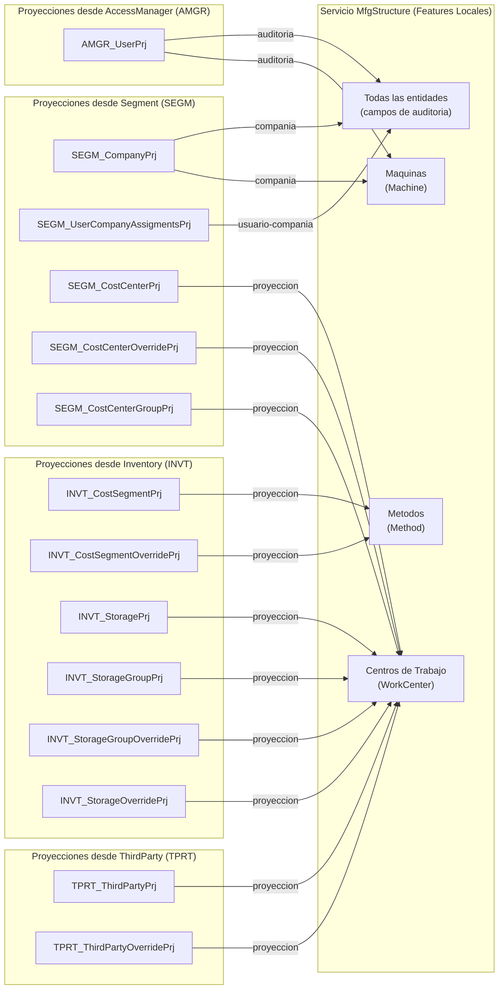

# Entidades Proyectadas del Servicio MfgStructure

**Version:** 1.0
**Producto:** Sistema ERP - Servicio de Estructura de Manufactura
**Proposito:** Documento de referencia para las entidades proyectadas que consume el servicio Estructura de Manufactura desde otros servicios

---

## Sobre este Documento

Este documento describe las **entidades proyectadas** (tablas locales que replican datos de otros servicios) que el servicio **MfgStructure** necesita para su funcionamiento. Su proposito es servir como **referencia centralizada** para la documentacion funcional de cada feature del servicio.

> **IMPORTANTE - Las entidades proyectadas NO son features**
>
> Las entidades definidas en este documento **no deben tratarse como features** en el proceso de planeacion y desarrollo. Son entidades de referencia que:
>
> - **No tienen interfaz de usuario propia** dentro del servicio MfgStructure
> - **No se planifican, estiman ni desarrollan** como features independientes
> - **Son de solo lectura** en el servicio MfgStructure (la fuente de verdad es el servicio origen)
> - **Se sincronizan mediante eventos** publicados en el servicio que es dueño de los datos
>
> Su unico proposito es proporcionar **integridad referencial local** (FK) y **datos para JOINs** que necesitan las entidades locales del servicio.

---

## Concepto de Proyeccion

Una proyeccion es una **tabla local que replica un subconjunto de datos** de una entidad que pertenece a otro servicio. Esto permite:

1. **Integridad referencial local:** Las FK apuntan a tablas propias del servicio
2. **Independencia entre servicios:** No se requieren llamadas sincronas entre microservicios
3. **Performance:** Consultas y JOINs locales sin latencia de red
4. **Disponibilidad:** El servicio funciona aunque el servicio origen este temporalmente caido

Para mas detalle sobre el patron de proyecciones, consultar: [Analisis de Proyecciones](./Analisis_de_Proyecciones.md)

---

## Resumen de Entidades Proyectadas

### Convencion de Nombres

Las entidades proyectadas siguen la convencion definida en el PRD global:

| Capa             | Patron                        | Ejemplo              |
| ---------------- | ----------------------------- | -------------------- |
| Clase C#         | `{PREFIX}_{Entity}Prj`        | `SEGM_CompanyPrj`    |
| Tabla PostgreSQL | `{prefix}_{origin_table}_prj` | `segm_companies_prj` |

**Prefijos de servicios origen:**

| Prefijo | Servicio Origen |
| ------- | --------------- |
| `AMGR`  | AccessManager   |
| `INVT`  | Inventory       |
| `SEGM`  | Segment         |
| `TPRT`  | ThirdParty      |

### Por Servicio Origen

| Servicio Origen   | Entidad Origen       | Clase C# Proyectada            | Tabla PostgreSQL Proyectada         |
| ----------------- | -------------------- | ------------------------------ | ----------------------------------- |
| **AccessManager** | User                 | `AMGR_UserPrj`                 | `amgr_users_prj`                    |
| **Inventory**     | CostSegment          | `INVT_CostSegmentPrj`          | `invt_cost_segments_prj`            |
| **Inventory**     | CostSegmentOverride  | `INVT_CostSegmentOverridePrj`  | `invt_cost_segments_overrides_prj`  |
| **Inventory**     | Storage              | `INVT_StoragePrj`              | `invt_storages_prj`                 |
| **Inventory**     | StorageGroup         | `INVT_StorageGroupPrj`         | `invt_storage_groups_prj`           |
| **Inventory**     | StorageGroupOverride | `INVT_StorageGroupOverridePrj` | `invt_storage_groups_overrides_prj` |
| **Inventory**     | StorageOverride      | `INVT_StorageOverridePrj`      | `invt_storage_overrides_prj`        |
| **Segment**       | Company                 | `SEGM_CompanyPrj`                 | `segm_companies_prj`                    |
| **Segment**       | OperationCenter         | `SEGM_OperationCenterPrj`         | `segm_operation_centers_prj`            |
| **Segment**       | OperationCenterOverride | `SEGM_OperationCenterOverridePrj` | `segm_operation_centers_overrides_prj`  |
| **Segment**       | UserCompanyAssigments   | `SEGM_UserCompanyAssigmentsPrj`   | `segm_user_company_assigments_prj`      |
| **Segment**       | CostCenter           | `SEGM_CostCenterPrj`           | `segm_cost_centers_prj`             |
| **Segment**       | CostCenterOverride   | `SEGM_CostCenterOverridePrj`   | `segm_cost_centers_overrides_prj`   |
| **Segment**       | CostCenterGroup      | `SEGM_CostCenterGroupPrj`      | `segm_cost_center_groups_prj`       |
| **ThirdParty**    | ThirdParty           | `TPRT_ThirdPartyPrj`           | `tprt_third_parties_prj`            |
| **ThirdParty**    | ThirdPartyOverride   | `TPRT_ThirdPartyOverridePrj`   | `tprt_third_parties_overrides_prj`  |

**Total: 16 entidades proyectadas** desde 4 servicios.

---

### Por Feature que las Consume

| Feature Local                                    | Entidades Proyectadas que Consume                                                                                                                                                                                     | Servicio Origen                |
| ------------------------------------------------ | --------------------------------------------------------------------------------------------------------------------------------------------------------------------------------------------------------------------- | ------------------------------ |
| **Todas las features** (campos de auditoria)     | AMGR_UserPrj                                                                                                                                                                                                          | AccessManager                  |
| **Todas las features** (contexto multi-compania) | SEGM_CompanyPrj                                                                                                                                                                                                       | Segment                        |
| **Centros de Trabajo** (WorkCenter)              | INVT_StoragePrj, INVT_StorageGroupPrj, INVT_StorageGroupOverridePrj, INVT_StorageOverridePrj, SEGM_CostCenterPrj, SEGM_CostCenterGroupPrj, SEGM_CostCenterOverridePrj, TPRT_ThirdPartyPrj, TPRT_ThirdPartyOverridePrj | Inventory, Segment, ThirdParty |
| **Maquinas** (Machine)                           | AMGR_UserPrj, SEGM_CompanyPrj                                                                                                                                                                                         | AccessManager, Segment         |
| **Metodos** (Method)                             | INVT_CostSegmentPrj, INVT_CostSegmentOverridePrj                                                                                                                                                                      | Inventory                      |

---

## Enums Utilizados

Los siguientes enums son utilizados por las entidades proyectadas:

### EnumCostType

```csharp
public enum EnumCostType : byte
{
    RawMaterial = 1,
    Labor = 2,
    ManufacturingOverhead = 3
}
```

---

## Detalle de Entidades Proyectadas

### 1. Proyecciones desde AccessManager Service

#### 1.1. AMGR_UserPrj

**Entidad origen:** User (AccessManager Service)

**Clase C# proyectada:** `AMGR_UserPrj`
**Tabla PostgreSQL proyectada:** `amgr_users_prj`

> **Nota:** Esta entidad es referenciada por los campos de auditoria (`CreatedByUserID`, `UpdatedByUserID`) de todas las entidades locales del servicio Estructura de Manufactura. Permite resolver los datos del usuario que creo o modifico un registro sin necesidad de consultar el servicio AccessManager.

| Campo C#           | Tipo de dato C# | Columna DB           | Observacion                                     |
| ------------------ | --------------- | -------------------- | ----------------------------------------------- |
| ID                 | Guid            | id                   | PK                                              |
| Code               | string(50)      | code                 | Codigo del usuario                              |
| Name               | string(200)     | name                 | Nombre del usuario                              |
| Email              | string(320)     | email                | Correo electronico del usuario                  |
| IsActive           | bool            | is_active            | Estado del usuario: false=Inactivo, true=Activo |
| SourceUpdatedAt    | DateTimeOffset  | source_updated_at    | Fecha de ultima actualizacion en origen         |
| ProjectionSyncedAt | DateTimeOffset  | projection_synced_at | Fecha de sincronizacion de la proyeccion        |

---

### 2. Proyecciones desde Inventory Service

#### 2.1. INVT_CostSegmentPrj

**Entidad origen:** CostSegment (Inventory Service)

**Clase C# proyectada:** `INVT_CostSegmentPrj`
**Tabla PostgreSQL proyectada:** `invt_cost_segments_prj`

| Campo C#                | Tipo de dato C#         | Columna DB                 | Observacion                                                                                                                                            |
| ----------------------- | ----------------------- | -------------------------- | ------------------------------------------------------------------------------------------------------------------------------------------------------ |
| ID                      | Guid                    | id                         | PK                                                                                                                                                     |
| Code                    | short                   | code                       | Codigo numerico unico del segmento. Por defecto existiran 3 segmentos: Materia Prima = 1, Mano de Obra = 2, Costos Indirectos de Fabricacion = 3       |
| Name                    | string(50)              | name                       | Nombre descriptivo del segmento de costo. Por defecto existiran 3 segmentos: Materia Prima = 1, Mano de Obra = 2, Costos Indirectos de Fabricacion = 3 |
| CostType                | EnumCostType (smallint) | cost_type                  | Tipo de costo: 1=Materia Prima, 2=Mano de Obra, 3=Costos Indirectos de Fabricacion                                                                     |
| IsNiif                  | bool                    | is_niif                    | Permite tratamiento NIIF (menor valor al inventario)                                                                                                   |
| IsPromptPaymentDiscount | bool                    | is_prompt_payment_discount | Permite descuento por pronto pago (mayor valor al inventario)                                                                                          |
| IsSystem                | bool                    | is_system                  | Indica si el registro es interno creado desde el sistema. true=Es del sistema, false=Es creado por el usuario                                          |
| SourceUpdatedAt         | DateTimeOffset          | source_updated_at          | Fecha de ultima actualizacion en origen                                                                                                                |
| ProjectionSyncedAt      | DateTimeOffset          | projection_synced_at       | Fecha de sincronizacion de la proyeccion                                                                                                               |

---

#### 2.2. INVT_CostSegmentOverridePrj

**Entidad origen:** CostSegmentOverride (Inventory Service)

**Clase C# proyectada:** `INVT_CostSegmentOverridePrj`
**Tabla PostgreSQL proyectada:** `invt_cost_segments_overrides_prj`

> **Nota:** Tabla de sobrescritura de datos por compania para segmentos de costo. Utiliza PK compuesta.

| Campo C#           | Tipo de dato C# | Columna DB           | Observacion                                     |
| ------------------ | --------------- | -------------------- | ----------------------------------------------- |
| CostSegmentID      | Guid            | cost_segment_id      | PK1. Identificador unico del segmento de costos |
| CompanyID          | Guid            | company_id           | PK2. Compania asignada al segmento de costos    |
| SourceUpdatedAt    | DateTimeOffset  | source_updated_at    | Fecha de ultima actualizacion en origen         |
| ProjectionSyncedAt | DateTimeOffset  | projection_synced_at | Fecha de sincronizacion de la proyeccion        |

---

#### 2.3. INVT_StoragePrj

**Entidad origen:** Storage (Inventory Service)

**Clase C# proyectada:** `INVT_StoragePrj`
**Tabla PostgreSQL proyectada:** `invt_storages_prj`

| Campo C#           | Tipo de dato C# | Columna DB           | Observacion                                      |
| ------------------ | --------------- | -------------------- | ------------------------------------------------ |
| ID                 | Guid            | id                   | PK                                               |
| Code               | string(25)      | code                 | Codigo de la bodega                              |
| Name               | string(200)     | name                 | Nombre de la bodega                              |
| StorageGroupID     | Guid            | storage_group_id     | Instalacion a la que pertenece la bodega         |
| IsActive           | bool            | is_active            | Estado de la bodega: false=Inactivo, true=Activo |
| OperationCenterID  | Guid            | operation_center_id  | Centro de operacion asociado                     |
| SourceUpdatedAt    | DateTimeOffset  | source_updated_at    | Fecha de ultima actualizacion en origen          |
| ProjectionSyncedAt | DateTimeOffset  | projection_synced_at | Fecha de sincronizacion de la proyeccion         |

---

#### 2.4. INVT_StorageGroupPrj

**Entidad origen:** StorageGroup (Inventory Service)

**Clase C# proyectada:** `INVT_StorageGroupPrj`
**Tabla PostgreSQL proyectada:** `invt_storage_groups_prj`

| Campo C#           | Tipo de dato C# | Columna DB           | Observacion                              |
| ------------------ | --------------- | -------------------- | ---------------------------------------- |
| ID                 | Guid            | id                   | PK                                       |
| Code               | string(25)      | code                 | Codigo de la instalacion                 |
| Name               | string(200)     | name                 | Nombre de la instalacion                 |
| SourceUpdatedAt    | DateTimeOffset  | source_updated_at    | Fecha de ultima actualizacion en origen  |
| ProjectionSyncedAt | DateTimeOffset  | projection_synced_at | Fecha de sincronizacion de la proyeccion |

---

#### 2.5. INVT_StorageGroupOverridePrj

**Entidad origen:** StorageGroupOverride (Inventory Service)

**Clase C# proyectada:** `INVT_StorageGroupOverridePrj`
**Tabla PostgreSQL proyectada:** `invt_storage_groups_overrides_prj`

> **Nota:** Tabla de sobrescritura de datos por compania para instalaciones. Utiliza PK compuesta.

| Campo C#           | Tipo de dato C# | Columna DB           | Observacion                                |
| ------------------ | --------------- | -------------------- | ------------------------------------------ |
| StoreGroupID       | Guid            | store_group_id       | PK1. Identificador unico de la instalacion |
| CompanyID          | Guid            | company_id           | PK2. Compania asignada a la instalacion    |
| SourceUpdatedAt    | DateTimeOffset  | source_updated_at    | Fecha de ultima actualizacion en origen    |
| ProjectionSyncedAt | DateTimeOffset  | projection_synced_at | Fecha de sincronizacion de la proyeccion   |

---

#### 2.6. INVT_StorageOverridePrj

**Entidad origen:** StorageOverride (Inventory Service)

**Clase C# proyectada:** `INVT_StorageOverridePrj`
**Tabla PostgreSQL proyectada:** `invt_storage_overrides_prj`

> **Nota:** Tabla de sobrescritura de datos por compania para bodegas. Utiliza PK compuesta.

| Campo C#           | Tipo de dato C# | Columna DB           | Observacion                              |
| ------------------ | --------------- | -------------------- | ---------------------------------------- |
| StoreID            | Guid            | store_id             | PK1. Identificador unico de la bodega    |
| CompanyID          | Guid            | company_id           | PK2. Compania asignada a la bodega       |
| SourceUpdatedAt    | DateTimeOffset  | source_updated_at    | Fecha de ultima actualizacion en origen  |
| ProjectionSyncedAt | DateTimeOffset  | projection_synced_at | Fecha de sincronizacion de la proyeccion |

---

### 3. Proyecciones desde Segment Service

#### 3.1. SEGM_CompanyPrj

**Entidad origen:** Company (Segment Service)

**Clase C# proyectada:** `SEGM_CompanyPrj`
**Tabla PostgreSQL proyectada:** `segm_companies_prj`

| Campo C#           | Tipo de dato C# | Columna DB           | Observacion                              |
| ------------------ | --------------- | -------------------- | ---------------------------------------- |
| ID                 | Guid            | id                   | PK                                       |
| Code               | string(50)      | code                 | Codigo de la compania                    |
| Name               | string(200)     | name                 | Razon social de la compania              |
| SourceUpdatedAt    | DateTimeOffset  | source_updated_at    | Fecha de ultima actualizacion en origen  |
| ProjectionSyncedAt | DateTimeOffset  | projection_synced_at | Fecha de sincronizacion de la proyeccion |

---

#### 3.2. SEGM_OperationCenterPrj

**Entidad origen:** OperationCenter (Segment Service)

**Clase C# proyectada:** `SEGM_OperationCenterPrj`
**Tabla PostgreSQL proyectada:** `segm_operation_centers_prj`

| Campo C#           | Tipo de dato C# | Columna DB           | Observación                                                          |
| ------------------ | --------------- | -------------------- | -------------------------------------------------------------------- |
| ID                 | Guid            | id                   | PK                                                                   |
| Code               | string(20)      | code                 | Código del centro de operaciones                                     |
| Name               | string(250)     | name                 | Nombre del centro de operaciones                                     |
| IsTitle            | bool            | is_title             | Indica si es centro título (agrupador).                              |
| IsActive           | bool            | is_active            | Estado del centro de operaciones (puede sobrescribirse por compañía) |
| SourceUpdatedAt    | DateTimeOffset  | source_updated_at    | Fecha de ultima actualizacion en origen                              |
| ProjectionSyncedAt | DateTimeOffset  | projection_synced_at | Fecha de sincronizacion de la proyeccion                             |

---

#### 3.3. SEGM_OperationCenterOverridePrj

**Entidad origen:** OperationCenterOverride (Segment Service)

**Clase C# proyectada:** `SEGM_OperationCenterOverridePrj`
**Tabla PostgreSQL proyectada:** `segm_operation_centers_overrides_prj`

> **Nota:** Tabla de sobrescritura de datos por compania para centros de operación. Utiliza PK compuesta.

| Campo C#           | Tipo de dato C# | Columna DB           | Observacion                                        |
| ------------------ | --------------- | -------------------- | -------------------------------------------------- |
| OperationCenterID  | Guid            | operation_center_id  | PK1. Identificador unico del centro de operaciones            |
| CompanyID          | Guid            | company_id           | PK2. Compania asignada al centro de operaciones               |
| IsActive           | bool?           | is_active            | Estado del centro de operaciones: false=Inactivo, true=Activo |
| SourceUpdatedAt    | DateTimeOffset? | source_updated_at    | Fecha de ultima actualizacion en origen                       |
| ProjectionSyncedAt | DateTimeOffset? | projection_synced_at | Fecha de sincronizacion de la proyeccion                      |

---

#### 3.4. SEGM_CostCenterPrj

**Entidad origen:** CostCenter (Segment Service)

**Clase C# proyectada:** `SEGM_CostCenterPrj`
**Tabla PostgreSQL proyectada:** `segm_cost_centers_prj`

| Campo C#           | Tipo de dato C# | Columna DB           | Observacion                                              |
| ------------------ | --------------- | -------------------- | -------------------------------------------------------- |
| ID                 | Guid            | id                   | PK                                                       |
| Code               | string(25)      | code                 | Codigo del centro de costos                              |
| Name               | string(200)     | name                 | Nombre del centro de costos                              |
| IsActive           | bool            | is_active            | Estado del centro de costos: false=Inactivo, true=Activo |
| IsTitle            | bool            | is_title             | Indica si es centro titulo                               |
| OperationCenterID  | Guid            | operation_center_id  | Centro de operacion asociado                             |
| CostCenterGroupID  | Guid?           | cost_center_group_id | Codigo del grupo de centro de costos asociado (nullable) |
| SourceUpdatedAt    | DateTimeOffset  | source_updated_at    | Fecha de ultima actualizacion en origen                  |
| ProjectionSyncedAt | DateTimeOffset  | projection_synced_at | Fecha de sincronizacion de la proyeccion                 |

---

#### 3.5. SEGM_CostCenterOverridePrj

**Entidad origen:** CostCenterOverride (Segment Service)

**Clase C# proyectada:** `SEGM_CostCenterOverridePrj`
**Tabla PostgreSQL proyectada:** `segm_cost_centers_overrides_prj`

> **Nota:** Tabla de sobrescritura de datos por compania para centros de costos. Utiliza PK compuesta.

| Campo C#           | Tipo de dato C# | Columna DB           | Observacion                                   |
| ------------------ | --------------- | -------------------- | --------------------------------------------- |
| CostCenterID       | Guid            | cost_center_id       | PK1. Identificador unico del centro de costos                |
| CompanyID          | Guid            | company_id           | PK2. Compania asignada al centro de costos                   |
| IsActive           | bool?           | is_active            | Estado del centro de costos: false=Inactivo, true=Activo     |
| SourceUpdatedAt    | DateTimeOffset? | source_updated_at    | Fecha de ultima actualizacion en origen                      |
| ProjectionSyncedAt | DateTimeOffset? | projection_synced_at | Fecha de sincronizacion de la proyeccion                     |

---

#### 3.6. SEGM_CostCenterGroupPrj

**Entidad origen:** CostCenterGroup (Segment Service)

**Clase C# proyectada:** `SEGM_CostCenterGroupPrj`
**Tabla PostgreSQL proyectada:** `segm_cost_center_groups_prj`

| Campo C#           | Tipo de dato C# | Columna DB           | Observacion                                   |
| ------------------ | --------------- | -------------------- | --------------------------------------------- |
| ID                 | Guid            | id                   | PK                                            |
| Code               | string(25)      | code                 | Codigo del grupo de centro de costos          |
| Name               | string(200)     | name                 | Nombre del grupo de centro de costos          |
| IsActive           | bool            | is_active            | Estado del grupo: false=Inactivo, true=Activo |
| SourceUpdatedAt    | DateTimeOffset  | source_updated_at    | Fecha de ultima actualizacion en origen       |
| ProjectionSyncedAt | DateTimeOffset  | projection_synced_at | Fecha de sincronizacion de la proyeccion      |

#### 3.7. SEGM_UserCompanyAssigmentsPrj

**Entidad origen:** UserCompanyAssigments (Segment Service)

**Clase C# proyectada:** `SEGM_UserCompanyAssigmentsPrj`
**Tabla PostgreSQL proyectada:** `segm_user_company_assigments_prj`

> **Nota:** Tabla que registra la asignacion de usuarios a companias. Permite verificar localmente a que companias tiene acceso un usuario sin necesidad de consultar el servicio Segment.

| Campo C#           | Tipo de dato C# | Columna DB           | Observacion                                          |
| ------------------ | --------------- | -------------------- | ---------------------------------------------------- |
| ID                 | Guid            | id                   | PK                                                   |
| CompanyID          | Guid            | company_id           | Compania asignada al usuario                         |
| UserID             | Guid            | user_id              | Usuario asignado a la compania                       |
| IsActive           | bool            | is_active            | Estado de la asignacion: false=Inactivo, true=Activo |
| SourceUpdatedAt    | DateTimeOffset? | source_updated_at    | Fecha de ultima actualizacion en origen              |
| ProjectionSyncedAt | DateTimeOffset? | projection_synced_at | Fecha de sincronizacion de la proyeccion             |

---

### 4. Proyecciones desde ThirdParty Service

#### 4.1. TPRT_ThirdPartyPrj

**Entidad origen:** ThirdParty (ThirdParty Service)

**Clase C# proyectada:** `TPRT_ThirdPartyPrj`
**Tabla PostgreSQL proyectada:** `tprt_third_parties_prj`

| Campo C#           | Tipo de dato C# | Columna DB           | Observacion                                     |
| ------------------ | --------------- | -------------------- | ----------------------------------------------- |
| ID                 | Guid            | id                   | PK                                              |
| Code               | string(50)      | code                 | Codigo del tercero                              |
| Name               | string(200)     | name                 | Razon social del tercero                        |
| IsActive           | bool            | is_active            | Estado del tercero: false=Inactivo, true=Activo    |
| IsPrivate          | bool            | is_private           | Tercero privado: false=No privado, true=Privado    |
| SourceUpdatedAt    | DateTimeOffset? | source_updated_at    | Fecha de ultima actualizacion en origen            |
| ProjectionSyncedAt | DateTimeOffset? | projection_synced_at | Fecha de sincronizacion de la proyeccion           |

---

#### 4.2. TPRT_ThirdPartyOverridePrj

**Entidad origen:** ThirdPartyOverride (ThirdParty Service)

**Clase C# proyectada:** `TPRT_ThirdPartyOverridePrj`
**Tabla PostgreSQL proyectada:** `tprt_third_parties_overrides_prj`

> **Nota:** Tabla de sobrescritura de datos por compania para terceros. Utiliza PK compuesta.

| Campo C#           | Tipo de dato C# | Columna DB           | Observacion                              |
| ------------------ | --------------- | -------------------- | ---------------------------------------- |
| ThirdPartyID       | Guid            | third_party_id       | PK1. Identificador unico del tercero                    |
| CompanyID          | Guid            | company_id           | PK2. Compania asignada al tercero                       |
| IsActive           | bool?           | is_active            | Estado del tercero: false=Inactivo, true=Activo         |
| IsPrivate          | bool?           | is_private           | Tercero privado: false=No privado, true=Privado         |
| SourceUpdatedAt    | DateTimeOffset? | source_updated_at    | Fecha de ultima actualizacion en origen                 |
| ProjectionSyncedAt | DateTimeOffset? | projection_synced_at | Fecha de sincronizacion de la proyeccion                |

---

## Diagrama de Dependencias de Proyecciones



---

## Notas para Documentacion de Features

Al documentar cada feature del servicio MfgStructure, tener en cuenta:

1. **Referenciar este documento:** Cuando un feature utilice campos FK que apuntan a entidades proyectadas, referenciar este documento en lugar de duplicar la definicion de la entidad proyectada.

2. **Campos FK en tablas de features:** En la documentacion de entidades locales, los campos que son FK a entidades proyectadas deben indicar claramente que apuntan a la tabla de proyeccion local (ej: `FK a SEGM_CompanyPrj.Id`), no a la tabla del servicio origen.

3. **LookupField y Endpoint Search:** Para que las entidades locales puedan referenciar datos de una entidad proyectada mediante el componente **LookupField**, cada entidad proyectada debe implementar su propio endpoint `Search` dentro del servicio MfgStructure. Este endpoint consulta la **tabla de proyeccion local** y sigue el patron estandar de la libreria `Siesa.BusinessUtilities.LookupFieldQueryBuilder`.

4. **No planificar como features:** Las entidades proyectadas se implementan como parte de la infraestructura del servicio. Su sincronizacion se configura una vez y no requiere desarrollo de UI, logica de negocio ni endpoints CRUD propios.

5. **Tablas de sobrescritura (Overrides):** Las entidades con sufijo `Override` representan sobrescrituras de datos por compania. Utilizan PK compuesta (`entity_id` + `company_id`) y permiten que cada compañia tenga visibilidad diferenciada sobre los registros maestros compartidos.
