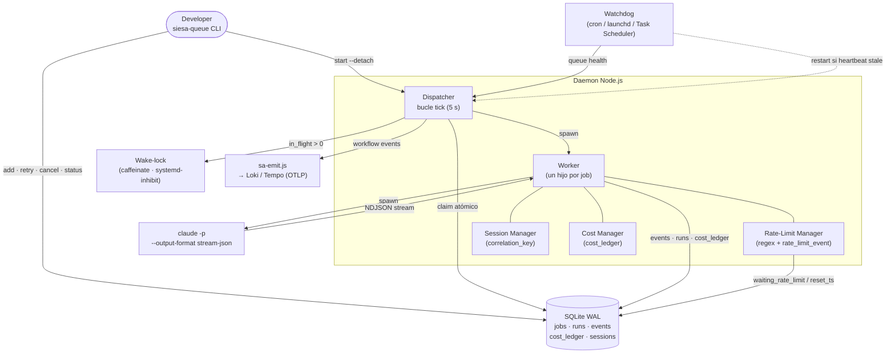
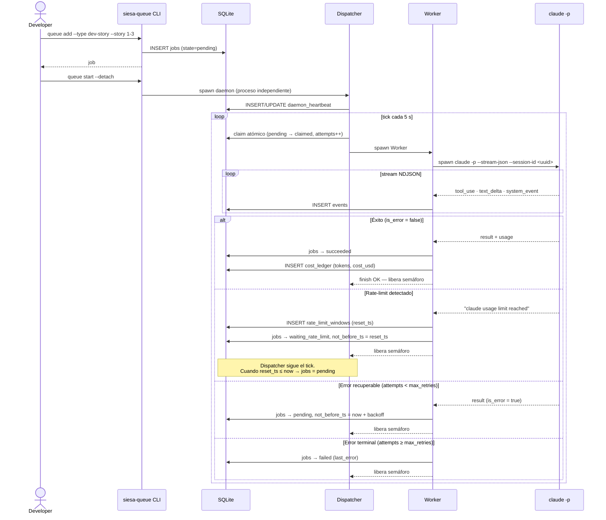

# Sentinel Queue

> **Feature**: *Autonomous Agent Queue Runner* para Claude Code en modo desatendido
> **Versión**: `siesa-agents` v2.1.77 — branch `queue-runner`
> **Fecha de implementación**: 2026-05-11

---

## ¿Qué es Sentinel Queue?

Sentinel Queue es un daemon Node.js que gestiona y ejecuta automáticamente los flujos BMAD (`create-story`, `dev-story`, `code-review`) de forma completamente desatendida. Se distribuye como parte del paquete `siesa-agents` y se instala en segundos con `npx siesa-agents queue init`.

A diferencia de una sesión interactiva de Claude Code, el daemon corre como proceso independiente: sobrevive al cierre de la terminal, detecta los rate-limits de la API y reanuda el trabajo solo cuando la ventana se reabre, sin intervención humana.

---

## El problema

Los flujos BMAD son largos. Antes de Sentinel Queue, ejecutarlos era operacionalmente frágil:

- **Plan window de 5 horas**: cuando el límite se agotaba a mitad del sprint, el usuario tenía que detectarlo manualmente, calcular cuándo se reabría la ventana y volver a lanzar el script en el momento exacto.
- **Dependencia de la sesión activa**: `/sa-quick-dev` y `bmad_orchestrator.py` morían si la terminal se cerraba o la sesión de Claude Code expiraba.
- **Sin cola persistente**: una sola historia por invocación, sin estado entre reinicios, sin gestión de reintentos.
- **Sin visibilidad de costos**: no había registro de tokens consumidos ni costo por modelo por iteración.

Esto desperdiciaba horas humanas vigilando una terminal.

---

## Los dos casos de uso que cubre

| Caso | Mecanismo | Comando |
|---|---|---|
| Background durante jornada | `--detach` + wake-lock automático | `siesa-queue start --detach` |
| Overnight / fin de semana | `--detach` + wake-lock automático | `siesa-queue start --detach` |
| + Sobrevivir reboot | `install-service` (opcional, no necesario para dev típico) | `siesa-queue install-service` |

Para los dos casos principales (background diurno y trabajo nocturno), el modo `--detach` es suficiente: el proceso queda independiente de la terminal, con wake-lock activo mientras haya jobs en vuelo. El modo `install-service` es la capa adicional para máquinas que se reinician.

---

## Relación con `/sa-quick-dev`

`sentinel-queue` y `/sa-quick-dev` son **complementarios, no alternativos**. Desde la v2.2, el queue delega el trabajo intra-épica a `/sa-quick-dev`:

| Responsabilidad | `/sa-quick-dev` | `sentinel-queue` |
|---|---|---|
| Ciclo create-story → dev-story → code-review | ✅ Orquesta los 3 sub-agentes | Invoca `/sa-quick-dev <N>` |
| Respetar el estado de cada historia (backlog/ready-for-dev/review) | ✅ Status-aware: solo corre las etapas pendientes | — |
| Rate-limit en la noche | Bloquea para siempre | ✅ Detecta, espera y reanuda solo |
| Dependencias inter-épica | ❌ Solo trabaja una épica a la vez | ✅ Gating por `depends_on_epics` |
| Persistencia ante reinicio/terminal cerrada | ❌ Muere con la sesión | ✅ Cola SQLite + daemon independiente |
| Monitoreo y costos | Solo la sesión activa | ✅ `queue status`, `queue logs --follow` |

**Cuándo usar solo `/sa-quick-dev`**: sesiones interactivas cortas donde el desarrollador está presente. Más simple, sin configuración.

**Cuándo usar `sentinel-queue`**: sprints largos, trabajo overnight, múltiples épicas con dependencias entre ellas, o cuando la terminal no puede quedar abierta. La combinación `sentinel-queue + sa-quick-dev` es la opción correcta para "encolar el sprint del lunes y que todo esté terminado el miércoles".

---

## Qué resuelve (outcome)

- Cola persistente en **SQLite** (WAL): ningún reinicio, suspensión o caída de red pierde el estado.
- **Detección automática de rate-limit** via regex sobre stdout/stderr + evento `rate_limit_event`: calcula el tiempo restante, espera y reanuda sin intervención.
- **Reutilización de `--session-id`** por `correlation_key`: mantiene el contexto BMAD acumulado entre `create-story` → `dev-story` → `code-review` de la misma historia.
- **Registro de costos** por modelo y por iteración en `cost_ledger`: visible con `queue status`.
- **Multi-OS**: daemon como `systemd --user` (Linux), LaunchAgent (macOS) o Task Scheduler (Windows).
- **Wake-lock** mientras hay jobs en vuelo: evita que el equipo se suspenda en medio de una historia.
- Logs **NDJSON estructurados** con rotación diaria, integrables con Loki/Tempo vía `sa-emit.js`.

---

## Cómo empezar (en 3 comandos)

```bash
# 1. Inicializar el queue (una sola vez por proyecto)
npx siesa-agents queue init

# 2. Importar las épicas del sprint (modo recomendado: un job por épica)
npx siesa-agents queue add --from-epics

# 3. Arrancar el daemon en background
npx siesa-agents queue start --detach

# Monitorear
npx siesa-agents queue status
npx siesa-agents queue logs --follow
```

`--from-epics` lee `sprint-status.yaml`, crea un job `quick-dev` por cada épica no completada y los ordena por número de épica (épica 1 antes de épica 2). Los jobs usan `correlation_key = "bmad-cycle"` — esto garantiza que solo una épica corra a la vez, incluso si la concurrencia del daemon es N>1.

Para importar con dependencias explícitas entre épicas (cuando la épica 3 depende de que la épica 1 termine, pero no de la épica 2):
```bash
npx siesa-agents queue add --type quick-dev --epic 3 --depends-on-epics 1
```

Para el flujo completo, instalación como servicio del SO, troubleshooting y referencia de todos los comandos, ver la guia operativa:

**[sentinel-queue-developer-guide.md](./sentinel-queue-developer-guide.md)**

Para verificar la implementacion contra los 18 Criterios de Aceptacion (44 tests):

**[sentinel-queue-testing-guide.md](./sentinel-queue-testing-guide.md)**

---

## Resumen de implementacion

El feature fue desarrollado en 7 historias BMAD ejecutadas via `sa-dev-story` en el sprint 2026-05:

| Historia | Entregable | Estado |
|---|---|---|
| 1-0 Scaffolding | `queue init`, `add`, `list`, schema SQLite, migraciones, `model-policy.json`, `rate-limit-patterns.json` | done |
| 1-1 Dispatcher + Worker | Daemon con bucle de claim atomico, semaforo=1, `worker.js` con `spawn claude -p`, state machine completa, `queue start --foreground/--detach` | done |
| 1-2 Rate-limit + retry | Rate-Limit Manager con regex hot-reload, `waiting_rate_limit`, backoff exponencial, rescate de runs huerfanos al arranque, watchdog cron | done |
| 1-3 Sessions + Cost Manager | Tabla `sessions`, `correlation_key` por historia/epica, `cost_ledger`, `queue status` con costos agregados | done |
| 1-4 Multi-OS service + wake-lock | `queue install-service` detecta SO, unidades systemd/plist/Task Scheduler, modulo `wake-lock.js` | done |
| 1-5 Telemetria OTLP | `telemetry-bridge.js` mapea eventos a `sa-emit.js`, `daily_budget_usd`, modo `paused`, dashboards Grafana | done |
| 1-6 Concurrencia >1 (opcional) | Semaforo endurecido, `queue pause/resume`, alertas por presupuesto, soak test concurrencia=2 | review |

---

## Archivos principales

```
bin/queue.js                                        ← entrypoint `npx siesa-agents queue ...`

siesa-agents/queue-runner/
├── cli/
│   ├── queue.js                                    ← router CLI (yargs, 13 subcomandos)
│   └── commands/                                   ← init, add, list, status, start, ...
├── runtime/
│   ├── dispatcher.js                               ← daemon principal (bucle, claim atomico, semaforo)
│   ├── worker.js                                   ← spawn `claude -p`, parser NDJSON streaming
│   └── watchdog.js                                 ← health-check externo (cron / launchd)
├── lib/
│   ├── schema.sql                                  ← DDL completo (PRAGMA user_version=4)
│   ├── migrations/                                 ← 4 migraciones evolutivas (001..004)
│   ├── rate-limit.js                               ← patterns + extractor de reset_ts
│   ├── sessions.js                                 ← Session Manager (correlation_key)
│   ├── cost.js                                     ← Cost Manager + calculo cost_usd
│   ├── wake-lock.js                                ← inhibidor de suspension por SO
│   ├── telemetry-bridge.js                         ← bridge a sa-emit.js (OTLP)
│   ├── logger.js                                   ← winston NDJSON con rotacion diaria
│   ├── semaphore.js                                ← semaforo en memoria
│   ├── sprint-status-parser.js                     ← lector de sprint-status.yaml (parseSprintStatus + getEpicStatuses)
│   ├── dependencies.js                             ← checkDependencies + resolveSprintStatusPath
│   └── installers/
│       ├── linux.js                                ← systemd --user + cron watchdog
│       ├── macos.js                                ← LaunchAgent plist
│       └── windows.js                              ← Task Scheduler / NSSM
└── config/
    ├── model-policy.json                           ← modelo por tipo de job y tarifas
    └── rate-limit-patterns.json                    ← patrones de deteccion hot-reloadables
```

---

## Diagramas

### Arquitectura de componentes



### Ciclo de vida de un job



---

## Cómo funciona por dentro

Esta sección explica cada componente para un desarrollador que quiere entender el sistema, depurarlo o extenderlo.

### El tick del Dispatcher — el latido del daemon

El **Dispatcher** (`runtime/dispatcher.js`) es el proceso principal. Una vez arrancado, ejecuta un bucle cada **5 segundos** (un "tick") que hace siempre lo mismo:

```
tick()
  │
  ├─ 1. Promover jobs con rate-limit vencido → pending
  ├─ 2. Aplicar backoffs vencidos → pending
  ├─ 3. ¿hay slot libre? (in_flight < maxConcurrency)
  │       └─ No → esperar al próximo tick
  ├─ 4. Claim atómico del próximo job elegible
  │       └─ Prioridad ↑ · not_before_ts ≤ now · correlation_key no ocupado
  ├─ 5. Spawn Worker para ese job
  └─ 6. Actualizar heartbeat en DB
```

El **claim atómico** (paso 4) es una transacción SQLite que garantiza que nunca dos workers toman el mismo job, aunque haya varios clientes mirando la DB. La `correlation_key` actúa como semáforo lógico: si ya hay un job con esa key en vuelo, los demás esperan en `pending`. Los jobs `quick-dev` usan la key fija `"bmad-cycle"` — esto hace que todas las épicas sean **estrictamente secuenciales** aunque la concurrencia sea N>1.

Antes de claimear un job, el Dispatcher verifica además el campo `payload.depends_on_epics`: si la lista no está vacía, lee `sprint-status.yaml` y comprueba que todas las épicas declaradas tengan status `done`. Si alguna no lo está, emite el evento `dependency_unmet` y salta al siguiente candidato en la cola.

```
pending ──claim──▶ claimed ──spawn OK──▶ running
                                │
              ┌─────────────────┼─────────────────────┐
              ▼                 ▼                      ▼
          succeeded      waiting_rate_limit        failed
              │                 │                      │
              └─────────────────┴──(retry)─────▶ pending
```

El Dispatcher también:
- Actualiza el **heartbeat** en `daemon_heartbeat` cada tick (Watchdog lo lee para detectar si el proceso murió).
- Activa / desactiva el **wake-lock** del SO cuando `in_flight` pasa de 0 a >0 y viceversa.
- Frena el claim cuando el **presupuesto diario** (`daily_budget_usd`) está agotado, y lo reactiva automáticamente a medianoche UTC.

---

### El Worker — quien habla con Claude

Cada job lanza un Worker independiente (`runtime/worker.js`). El Worker:

1. **Construye el prompt** para `claude --print` según el tipo de job (`dev-story`, `code-review`, etc.) usando `prompt-builder.js`.
2. **Resolves el binario** de Claude: busca en `SIESA_CLAUDE_BIN` → PATH → `npx claude`. Esto permite inyectar un mock en tests.
3. **Lanza `claude --print --output-format stream-json`** como subproceso hijo via `node:child_process`. Claude hereda el entorno del proceso padre — incluyendo la sesión OAuth de `~/.claude/` — por lo que no necesita API key.
4. **Lee la salida NDJSON línea a línea**: cada línea puede ser `tool_use`, `text_delta`, `system_event` o el `result` final. Los eventos se guardan en la tabla `events` para trazabilidad.
5. Al recibir el `result`:
   - Si `is_error = false` → job pasa a `succeeded`, se registra el costo.
   - Si contiene "usage limit reached" / "rate limit" → activa el Rate-Limit Manager.
   - Si es error recuperable y `attempts < max_retries` → vuelve a `pending` con backoff.
   - Si `attempts >= max_retries` → `failed`.

El Worker detecta rate-limits desde **tres fuentes** simultáneas para no perder ninguna señal:

| Fuente | Ejemplo |
|---|---|
| Stderr regex (hot-reload) | `"Claude usage limit reached, resets at 1234567890"` |
| Evento `rate_limit_event` en el stream JSON | `{"type":"system_event","subtype":"rate_limit_event"}` |
| Heurística: >3 reintentos internos de Claude en 30 s | Detecta 529/503 sin mensaje explícito |

---

### Rate-Limit Manager — esperar sin bloquear

Cuando se detecta un rate-limit, el sistema distingue dos casos:

```
reset_ts - now ≤ 600 s  →  "espera corta"
                            Worker mantiene el proceso vivo
                            Loop interno cada 5 s
                            Log de countdown cada 30 s
                            Claude se relanza automáticamente

reset_ts - now > 600 s  →  "espera larga" (noche / plan exhaustion)
                            job → waiting_rate_limit (not_before_ts = reset_ts)
                            Worker libera semáforo y termina
                            Dispatcher sigue el tick normal
                            Cuando not_before_ts ≤ now → job vuelve a pending
```

Los **patrones de detección** viven en `config/rate-limit-patterns.json` y se pueden recargar en caliente con `npx siesa-queue config reload-patterns` sin reiniciar el daemon. Cada patrón tiene un campo `extract` que le dice al parser cómo calcular el `reset_ts`: o extrae un epoch Unix del mensaje, o extrae una duración en minutos/segundos y la suma al timestamp actual.

---

### Session Manager — memoria entre jobs de la misma historia

Claude Code soporta `--session-id <uuid>` para reutilizar el contexto de una conversación. El Session Manager (`lib/sessions.js`) explota esto:

- Cada `correlation_key` (e.g. `story-1-3`) tiene un `session_id` persistente en la tabla `sessions`.
- Los tres jobs de una historia (`create-story` → `dev-story` → `code-review`) **comparten el mismo `session_id`**.
- Claude ve el historial acumulado: sabe qué archivos creó, qué decisiones tomó, cómo quedó el código.
- Historias distintas tienen `session_id` distintos → no se mezcla el contexto.

```
correlation_key = "story-1-3"  (modo legacy individual)
  ├── job create-story  → claude --session-id abc123
  ├── job dev-story     → claude --session-id abc123  ← mismo contexto
  └── job code-review   → claude --session-id abc123  ← mismo contexto

correlation_key = "bmad-cycle"  (modo épica recomendado)
  ├── job quick-dev epic-1  → claude --session-id def456  → /sa-quick-dev 1
  └── job quick-dev epic-2  → claude --session-id ghi789  → /sa-quick-dev 2
      (solo corre cuando epic-1 termine)
```

---

### Modo orquestación por épicas — la nueva arquitectura recomendada

En la arquitectura actual, el queue-runner **no orquesta los workflows BMAD directamente**. En su lugar, delega la lógica intra-épica al slash command `/sa-quick-dev`, que ya sabe cómo:

- Descubrir las historias pendientes de la épica.
- Respetar el estado actual de cada historia (`backlog` → `ready-for-dev` → `in-progress` → `review` → `done`).
- Saltar las etapas ya completadas cuando un job se reintenta (idempotencia).
- Ejecutar el ciclo `create-story → dev-story → code-review` en secuencia para cada historia.

El queue-runner es el responsable del plano **inter-épica**:

```
queue add --from-epics
  └── epic-1 (priority=101, correlation_key="bmad-cycle", no deps)
  └── epic-2 (priority=102, correlation_key="bmad-cycle", no deps)
  └── epic-3 (priority=103, correlation_key="bmad-cycle", depends_on_epics=[1])

dispatcher tick
  ├── claim epic-1 → spawn claude "/sa-quick-dev 1 ..."
  │     (epic-2 y epic-3 bloqueadas por bmad-cycle mutex)
  │     /sa-quick-dev 1 procesa sus historias en orden
  │     al terminar: epic-1 = done en sprint-status.yaml
  ├── claim epic-2 → spawn claude "/sa-quick-dev 2 ..."
  │     (epic-3 bloqueada por depends_on_epics=[1] pero epic-1 ya done ✓)
  └── claim epic-3 → spawn claude "/sa-quick-dev 3 ..."
        (si epic-1 estuviese en-progress, epic-3 quedaría en pending
         con evento dependency_unmet hasta que epic-1 pase a done)
```

**Tipos de job disponibles:**

| Tipo | Uso recomendado | `correlation_key` |
|---|---|---|
| `quick-dev` | Una épica completa (recomendado) | `"bmad-cycle"` (fija) |
| `create-story` | Re-crear una historia específica | `"story-N-M"` |
| `dev-story` | Re-implementar una historia específica | `"story-N-M"` |
| `code-review` | Re-revisar una historia específica | `"story-N-M"` |
| `custom` | Cualquier prompt libre | configurable |

---

### Cost Manager — registro de lo que se gasta

Después de cada job exitoso, el Worker llama a `lib/cost.js` que:

1. Lee `input_tokens` y `output_tokens` del campo `usage` en el `result` de Claude.
2. Busca las tarifas del modelo en `model-policy.json` (campo `rates_usd_per_mtok`).
3. Calcula `cost_usd = (input_tokens / 1_000_000) * input_rate + (output_tokens / 1_000_000) * output_rate`.
4. Inserta una fila en `cost_ledger` con modelo, tokens, costo y timestamp.

`npx siesa-queue status` agrega esta tabla por modelo y por día. `npx siesa-queue status --json` la expone para dashboards externos.

---

### Watchdog — el vigilante externo

El Dispatcher se registra a sí mismo como "vivo" actualizando `daemon_heartbeat.last_beat_ts` cada tick (5 s). El Watchdog (`runtime/watchdog.js`) es un proceso **separado** que se instala como cron job o launchd timer y corre cada N minutos:

```
watchdog.js
  │
  ├─ Lee last_beat_ts de la DB
  ├─ Si age ≤ 180 s → "ok", exit 0
  └─ Si age > 180 s → daemon probablemente colgado
        ├─ Verifica si el PID sigue vivo (kill -0)
        └─ Si sí pero stale: SIGTERM → el SO/cron relanza
```

`npx siesa-queue health` usa el mismo check pero sin el restart (solo informa).

---

## Las librerías que hacen posible el sistema

### `better-sqlite3` — SQLite empaquetado en el npm

Esta es la librería más importante del sistema. Permite que **SQLite no necesite estar instalado en el sistema operativo**:

- `better-sqlite3` es un **módulo nativo de Node.js** (C++ compilado). Se distribuye como binario precompilado dentro del paquete `siesa-agents` en `node_modules/better-sqlite3/`.
- Cuando `npx siesa-agents@latest` descarga el paquete, descarga también este binario. No hay `apt install`, `brew install` ni permisos de administrador.
- La API es **síncrona**: `db.prepare("SELECT ...").all()` bloquea y retorna el resultado, sin callbacks ni Promises. Esto simplifica enormemente el código del Dispatcher (que ya corre en un bucle).
- Activa **WAL mode** (`journal_mode=WAL`): permite que la CLI (`npx siesa-queue status`) lea la DB mientras el daemon está escribiendo, sin bloqueos.

```js
// Así abre la DB cualquier comando del CLI:
const db = openDb('~/.siesa-queue/queue.db');
const rows = db.prepare('SELECT * FROM jobs WHERE state = ?').all('pending');
db.close();
```

El comando `npx siesa-queue db "..."` (documentado en la guía de testing) usa exactamente esta misma librería — por eso tampoco necesita el binario `sqlite3` del sistema operativo.

---

### `yargs` — el router del CLI

`yargs` es la librería que convierte `npx siesa-queue add --type dev-story --story 1-3 --epic 1` en una llamada a la función `handler()` del comando `add.js` con `argv = { type: 'dev-story', story: '1-3', epic: 1 }`. Define los subcomandos, valida tipos, genera `--help` automáticamente.

El router está en `cli/queue.js`: registra cada comando como un módulo independiente en `cli/commands/`.

---

### `winston` + `winston-daily-rotate-file` — logs estructurados

Todos los eventos del daemon se escriben como **NDJSON** (una línea JSON por evento) en `~/.siesa-queue/logs/queue-YYYY-MM-DD.ndjson`. Cada línea tiene al menos:

```json
{"ts":1715432100,"level":"info","event":"job.finish","job_id":42,"state":"succeeded","cost_usd":0.0034}
```

`winston-daily-rotate-file` crea un archivo nuevo cada día y comprime los anteriores en `.gz`. `npx siesa-queue logs --follow` hace un `tail -f` de estos archivos, formateando las líneas en tiempo real.

---

### `node:child_process` — cómo se lanza Claude

Es un módulo nativo de Node.js (no hay que instalar nada). El Worker usa `spawn()` — no `exec()` — para lanzar Claude porque `spawn` permite leer la salida **línea a línea en streaming** sin esperar a que el proceso termine. Esto es lo que permite registrar eventos en tiempo real y detectar rate-limits inmediatamente sin esperar el resultado final.

```
spawn('claude', ['--print', '--output-format', 'stream-json', '--model', 'sonnet', ...])
  ↓
stdout: NDJSON line by line  ← Worker lee y parsea aquí
stderr: texto plano          ← Rate-Limit Manager busca patrones aquí
```

---

## El schema de la base de datos

La DB vive en `~/.siesa-queue/queue.db`. Estas son las tablas principales:

```
jobs                    ← Una fila por job encolado
  id, type, state       ← Estado actual de la máquina de estados
  correlation_key       ← "story-1-3" — agrupa los 3 jobs de una historia
  priority              ← Número: 10 = urgente, 100 = normal
  not_before_ts         ← Epoch Unix: "no ejecutar antes de este momento"
  attempts, max_retries ← Control de reintentos
  input_fingerprint     ← Hash del payload — garantiza idempotencia al re-add

runs                    ← Una fila por intento de ejecución
  job_id, attempt_number
  model_used, duration_ms
  raw_log_path          ← Ruta al log crudo de Claude para ese run

events                  ← Eventos NDJSON del stream de Claude, por run
  run_id, ts, event, payload

cost_ledger             ← Registro de costos por job exitoso
  job_id, model, input_tokens, output_tokens, cost_usd

sessions                ← session_id de Claude por correlation_key
  correlation_key, session_id, invocations, abandoned

rate_limit_windows      ← Ventanas de rate-limit detectadas
  source, category, reset_ts, closed_at

daemon_heartbeat        ← Latido del daemon (una sola fila)
  pid, last_beat_ts, version

daemon_config           ← Configuración en caliente (concurrency, paused)
  key, value
```

Para inspeccionar la DB en cualquier momento desde cualquier OS:

```bash
npx siesa-queue db ".tables"                                  # listar tablas
npx siesa-queue db "SELECT * FROM jobs"                       # ver todos los jobs
npx siesa-queue db "SELECT * FROM cost_ledger" --json         # costos en JSON
npx siesa-queue db "PRAGMA user_version"                      # versión del schema
```

---

## Configuración: `model-policy.json` y `rate-limit-patterns.json`

Estos dos archivos se copian a `~/.siesa-queue/` en el primer `init` y se pueden editar libremente sin tocar el código del paquete.

### `model-policy.json`

```jsonc
{
  "default": "sonnet",                        // modelo de fallback
  "by_type": {
    "create-story": "haiku",                  // jobs rápidos → modelo barato
    "dev-story":    "sonnet",                 // implementación → modelo capaz
    "code-review":  "haiku",                  // revisión ligera → modelo barato
    "custom":       "haiku"
  },
  "rates_usd_per_mtok": {                     // para calcular cost_usd
    "haiku":  { "input": 0.80, "output": 4.00 },
    "sonnet": { "input": 3.00, "output": 15.00 }
  },
  "daily_budget_usd": null                    // null = sin límite; 5.00 = pausa a los $5
}
```

El campo `by_type` se aplica si el job no tiene `--model` explícito. `--model` al agregar el job tiene precedencia total.

### `rate-limit-patterns.json`

```jsonc
[
  {
    "id": "claude_usage_limit",
    "re": "claude usage limit reached.*resets at (\\d+)",
    "category": "plan_exhaustion",
    "extract": "epoch"                        // captura el timestamp Unix del mensaje
  },
  {
    "id": "try_again_in",
    "re": "try again in (\\d+) (minute|second)",
    "category": "transient",
    "extract": "duration"                     // calcula reset_ts = now + duración
  }
]
```

Para agregar un nuevo patrón (por ejemplo, un mensaje de error nuevo de la API de Anthropic):
1. Editar `~/.siesa-queue/rate-limit-patterns.json`.
2. Ejecutar `npx siesa-queue config reload-patterns`.
3. El daemon recarga sin reiniciar.

---

## Preguntas frecuentes

**¿Necesito tener `sqlite3` instalado?**
No. La DB la maneja `better-sqlite3`, una librería Node.js incluida en el paquete. Para consultar la DB usa `npx siesa-queue db "SELECT ..."` en lugar del comando del sistema `sqlite3`.

**¿Necesito una `ANTHROPIC_API_KEY`?**
No, si ya estás logueado con `claude` interactivamente. El Worker lanza `claude --print` como subproceso y hereda la sesión OAuth de `~/.claude/.credentials.json`. `init` detecta esta sesión y no te pide la key. La key solo es necesaria si usás autenticación por API key en lugar de OAuth.

**¿Qué pasa si apago el equipo con jobs en vuelo?**
Al relanzar el daemon, `rescueOrphans()` detecta los jobs que quedaron en `claimed`/`running` sin proceso activo, los vuelve a `pending` y los re-ejecuta. Nada se pierde.

**¿Puedo correr dos daemons al mismo tiempo?**
No. El claim atómico y el heartbeat usan la misma DB — dos daemons competerían por los mismos jobs. Si querés escalar, aumentá `concurrency` en el mismo daemon: `npx siesa-queue config set concurrency 2`.

**¿Cómo sé qué está pasando en este momento?**
```bash
npx siesa-queue status          # resumen: jobs por estado, costo hoy, heartbeat
npx siesa-queue list            # tabla detallada de todos los jobs
npx siesa-queue logs --follow   # streaming de eventos en tiempo real
npx siesa-queue health          # ¿está vivo el daemon? (exit 0 = sí, exit 2 = stale)
```

---

## Documentos relacionados

| Documento | Proposito |
|---|---|
| [sentinel-queue-developer-guide.md](./sentinel-queue-developer-guide.md) | Manual operativo: instalacion, arranque, monitoreo, troubleshooting, referencia de comandos |
| [sentinel-queue-testing-guide.md](./sentinel-queue-testing-guide.md) | 44 tests organizados en 12 bloques, cubren los 18 Criterios de Aceptacion + escenario sprint overnight |
